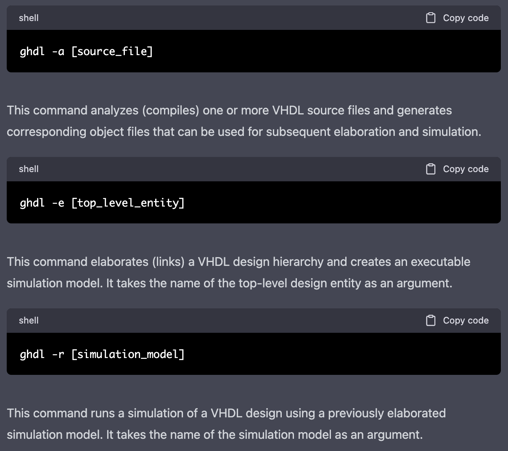

# Lab 1: GHDL and GTKWave

## Part 1: Downloading GHDL and GTKWave

This part of the lab involves downloading and installing GHDL and GTKWave. GHDL is a simulator for VHDL, and GTKWave is a waveform viewer. Both are free and open source.

### GHDL

```bash
$ cd Downloads
$ sudo mv ghdl-0.37-macosx-mcode /usr/local
$ sudo mv gtkwave.app /Applications
```

```bash
$ vim /etc/paths
```

Then I added the following lines to the end of the file:

```bash
/usr/local/ghdl-macos-12-mcode/bin
/Applications/gtkwave.app/Contents/Resources/bin
```

I had an error that Perl's Switch Module wasn't install and so from [this] (https://ughe.github.io/2018/11/06/gtkwave-osx) website that I used to help, I found that I needed to install Switch with this command:

```bash
$ sudo cpan install Switch
```

This allows me to run GHDL and GTKWave from any directory.

## Part 2: Running GHDL

This part of the lab involves using code from the [DSD Github Repository](https://github.com/kevinwlu/dsd/tree/master/) to create basic VHDL code and simulate it using GHDL.

I used ChatGPT to explain some basic shell commands to help me understand programs that will follow:



### Basic Hello World Program

The following commands were used to execute the Hello World program:


Looking at the file 'hello.vhdl', some important lines that I've noted are as follows:

```vhdl
variable l : line
```

This line declares a variable called 'l' that is of type 'line'.

'line' appears to be defined in the std.textio and is some kind of output file.

```vhdl
write (l, String'("Hello world!"));
```

This line appears the write the string "Hello world!" to the variable 'l' (the output file).

```vhdl
writeline (output, l);
```

This line appears to write the contents of 'l' to the output (console).

### Half Adder

To open this progrma in gtkwave, I used the following commands:


Note: The --vcd=ha.vcd saves the output to a file called 'ha.vcd' which is used by gtkwave to display the waveform.

After zoom fitting the plot it looks like this:


So orginally, I had no idea what a half adder was, but after asking ChatGPT and looking at the code, I understand it.

In simplest terms:
**S = A XOR B** and
**C = A AND B**

This is proved in the code with the following lines in ha.vhdl:

```vhdl
    s <= a xor b;
    c <= a and b;
```

The ha_tb.vhdl simply goes through all possible combinations of A and B.
