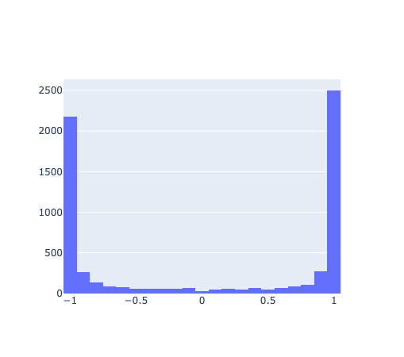
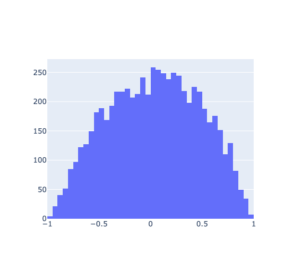

# Makemore - Part 3

## Introduction

This will follow the [Building makemore Part 3: Activations & Gradients, BatchNorm](https://www.youtube.com/watch?v=P6sfmUTpUmc) lecture on youtube by the (former) director of AI at Tesla, Andrej Karpathy.

This continues the makemore labs from labs 8/9.

## Optimization

### Uniform Output Probabilities

Remember that we calculated the logits using:

```python
logits = h @ W2 + b2 #len(X_train) x len(chars)
```

We then used the softmax function to convert the logits to probabilities:

```python
counts = torch.exp(logits)
probs = counts / counts.sum(dim=1, keepdim=True)
```

- We orginially initilize the weights and biases to be random values.
- This means that the output probabilities are also random. We want the output probabilities to be uniform.
- We can do this by initilizing the weights and biases of the output layer to be close to zero.

```python
W2 = torch.randn(hidden_size, len(chars), generator=g)*0.01
b2 = torch.randn(len(chars), generator=g)*0
```

### Dead Neurons

For our network we use the tanh activation function to squash the output of the hidden layer to be between -1 and 1.

$$ tanh(x) = \frac{e^x - e^{-x}}{e^x + e^{-x}} $$

The derivative of the tanh function is:

$$ \frac{d}{dx}tanh(x) = 1 - tanh^2(x) $$

- We observe that when tanh(x) is close to 1 or -1, the derivative is close to 0.
- This means that the gradient is close to 0.
- This is a problem because the gradient is used to update the weights and biases. If the gradient is close to 0, then the weights and biases will not be updated.
- Any parameter behind this neuron will multiply by 0, essentially stopping the backpropagation.

Previously we initilized the weights and biases of the hidden layer to be random values.

```python
W1 = torch.randn(emb_dim*block_size, hidden_size, generator=g)
b1 = torch.randn(hidden_size, generator=g)
```

Plotting the distribution of the hidden layer output, we see that many of the values are close to 1 or -1.



We can fix this by initilizing the weights and biases of the hidden layer to be close to zero.

```python
W1 = torch.randn(emb_dim*block_size, hidden_size, generator=g) * 0.1
b1 = torch.randn(hidden_size, generator=g) * .01
```

Plotting the distribution of the hidden layer output, we see that the values are more spread out.



### Calculating the initial scale with Kaiming

Assume we have an output layer with 1000 examples and 200 neurons.

```python
x = torch.randn(1000,10)
w = torch.randn(10,200)
y = x @ w
```

Randn initializes with a gaussian distribution with mean 0 and variance 1.

Printing the mean and stddev of x and y give the following output:

```
x mean: 0.0 std: 1.0
y mean: -0.01 std: 3.13
```

- The goal is to have the mean and stddev of y to be the same as x.
- This is so that the gradient is not too large or too small.

How do we scale w so that the mean and stddev of y is the same as x?

```python
x = torch.randn(1000,10)
w = torch.randn(10,200) / 10**0.5
y = x @ w
```

Printing the mean and stddev of x and y give the following output:

```
x mean: -0.01 std: 1.0
y mean: 0.0 std: 1.0
```

By dividing w by $ \sqrt{n} $, ($n$ being the number of inputs) we can scale the output to have the same mean and stddev as the input.

#### Gain

Non-linear activation functions have a slope that is not 1. This means that the output will not have the same mean and stddev as the input.

We can fix this by multiplying the weights by a gain.

| Function   | Gain                              |
| ---------- | --------------------------------- |
| Linear     | 1                                 |
| ReLU       | $ \sqrt{2} $                      |
| Leaky ReLU | $ \sqrt{\frac{2}{1 + \alpha^2}} $ |
| Tanh       | $ 5/3 $                           |
| Sigmoid    | $ 1 $                             |
| SELU       | $ 3/4 $                           |

We have a tanh activation function in the hidden layer, so we will use a gain of $ 5/3 $.

```python
W1 = torch.randn(emb_dim*block_size, hidden_size, generator=g) * (5/3) * (1/sqrt(emb_dim*block_size))
```

### Batch Normalization

- We don't want the input to the hidden layer to be too large or too small (because tanh is sensitive to large/small inputs).
- We want the input to the hidden layer to have a mean of 0 and stddev of 1 (gaussian distribution)

We can normalize each input to the hidden layer by subtracting the mean and dividing by the stddev.

$$
\hat{x} = \frac{x - \mu}{\sqrt{\sigma^2 + \epsilon}}
$$

- $\mu$ is the mean of the input
- $\sigma$ is the stddev of the input
- $\epsilon$ is a small number to prevent division by 0
- $\hat{x}$ is the normalized input

Our old code is this for the pre-activation:

```python
hpreact = emb @ W1 + b1
```

If we run it once and then print the mean and stddev of the first output with the following code:

```python
#Print mean and stddev of hpreact
mean = hpreact.mean(0)[0].item()
stddev = hpreact.std(0)[0].item()
print("Mean:", mean, "Stddev:", stddev)
```

I get:

```
Mean: -0.488584041595459 Stddev: 1.8004093170166016
```

Now if we apply the normalization to the pre-activation:

```python
hpreact = emb @ W1 + b1
#Batch norm
mean = hpreact.mean(0)
var = hpreact.var(0)
hpreact = (hpreact - mean) / torch.sqrt(var + 1e-8)
```

I get:

```
Mean: 0.0 Stddev: 0.9999999403953552
```

We want the network to be able to scale and shift it before the activation function.

This will allow the network to learn the mean and stddev of the input to the hidden layer.

To do this we add two parameters to the hidden layer:

```python
bngain = torch.ones((1, hidden_size))
bnbias = torch.zeros((1,hidden_size))
```

We then multiply the normalized input by bngain and add bnbias.

```python
hpreact = hpreact * bngain + bnbias
```

#### End of training batch norm

##### Method 1 (Simple)

The simplest way to do this is to do it like we did before, but instead of using the mean and variance of the batch, we use the mean and variance of the entire training set.

```python
#Calculate batch norm after training
emb = C[X_train]
emb = emb.view(len(X_train), -1) #len(X_train) x (block_size*2)
hpreact = emb @ W1 + b1
#Batch norm
mean = hpreact.mean(0, keepdim=True)
var = hpreact.var(0, keepdim=True)
```

However, we can skip this step by creating a running mean and stddev, and using that instead.

##### Method 2 (Running mean and stddev)

We define two tensors to hold the running mean and stddev.

```python
bnmean_running = torch.ones((1, hidden_size))
bnstd_running = torch.zeros((1,hidden_size))
```

Now, as we train, we update the running mean and stddev; pushing the mean and stddev of the batch closer to the mean and stddev of the training set.

```python
#Now update the running mean and stddev to move in the direction of the batch's mean and stddev
with torch.no_grad():
    bnmean_running = .9 * bnmean_running + .1 * mean
    bnstd_running = .9 * bnstd_running + .1 * var
```

The longer we run it the closer it should get to the mean and stddev of the training set because it'll slowly cover the entire training set.

Running it 20,000 times we can se they are quite similar

```
Method 1 Mean: -0.5370499491691589 Stddev: 1.719202995300293
Method 2 Mean: -0.4815045893192291 Stddev: 1.7326515913009644
Percent difference (Mean): 11.535790329322117
Percent difference (Stddev): -0.7761858222502475
```

#### Removing the hidden layer bias

If we look at the code:

```python
hpreact = emb @ W1 + b1
#Batch norm
mean = hpreact.mean(0, keepdim=True)
var = hpreact.var(0, keepdim=True)
hpreact = (hpreact - mean) / torch.sqrt(var + 1e-8)
hpreact = hpreact * bngain + bnbias
```

We can see that we are adding the bias to the pre-activation, and then subtracting it again after the batch norm.

This is redundant, so we can remove the bias from the hidden layer.

```python
hpreact = emb @ W1
#Batch norm
mean = hpreact.mean(0, keepdim=True)
var = hpreact.var(0, keepdim=True)
hpreact = (hpreact - mean) / torch.sqrt(var + 1e-8)
hpreact = hpreact * bngain + bnbias
```

## Converting our code to PyTorch

We will create some classes to replicate the code we wrote above.

The names and attributes are based on the [PyTorch documentation](https://pytorch.org/docs/stable/generated/torch.nn.Linear.html#torch.nn.Linear).

### Linear Layer

```python
#Create a Linear Layer Class
class Linear:
    def __init__(self, fan_in, fan_out, bias=True):
        self.weight = torch.randn(fan_in, fan_out) / fan_in**.5
        self.bias = torch.zeros(fan_out) if bias else None
        self.params = [self.weight] + ([self.bias] if bias else [])

    def __call__(self, x):
        self.out = x @ self.weight
        if self.bias is not None:
            self.out += self.bias
        return self.out

    def parameters(self):
        return self.params

#Create a Linear Layer Class to test
linear = Linear(10, 200, False)

x = torch.randn(1000,10)
y = linear(x)

```

### Batch Norm

```python
#Creating the Batch Normalization Layer
class BatchNorm1d:
    def __init__(self,dim,eps=1e-5,momentum=.1):
        self.eps = eps
        self.momentum = momentum
        self.dim = dim
        self.gamma = torch.ones(dim) #Gain
        self.beta = torch.zeros(dim) #Bias
        self.params = [self.gamma,self.beta]
        self.running_mean = torch.zeros(dim)
        self.running_var = torch.ones(dim)

        self.training = True

    def __call__(self,x):
        #Calculate Forward Pass
        if self.training:
            #Use batch mean
            xmean = x.mean(dim=0, keepdim=True)
            xvar = x.var(dim=0, keepdim=True)
        else:
            #Use running mean
            xmean = self.running_mean
            xvar = self.running_var

        xhat = (x - xmean) / torch.sqrt(xvar + self.eps) #Make it a gaussian (mean 0, std 1)
        self.out = self.gamma * xhat + self.beta #Scale and shiftA

        #Update running mean and variance
        if self.training:
            with torch.no_grad():
                self.running_mean = self.momentum * xmean + (1 - self.momentum) * self.running_mean
                self.running_var = self.momentum * xvar + (1 - self.momentum) * self.running_var

        return self.out

    def parameters(self):
        return self.params
```

### Tanh

```python
class Tanh:
    def __init__(self):
        self.params = []

    def __call__(self, x):
        self.out = x.tanh()
        return self.out

    def parameters(self):
        return self.params
```

### Initializing the model

```python
#Convert the model to use the new layers

n_embd = 10
n_hidden=  100
g = torch.Generator().manual_seed(2147483647)

C = torch.randn(len(chars), n_embd, generator=g)

layers = [
    Linear(n_embd * block_size, n_hidden, bias=False), #Remembers block size is the amount of context we are using
    BatchNorm1d(n_hidden),
    Tanh(),

    Linear(n_hidden, n_hidden, False),
    BatchNorm1d(n_hidden),
    Tanh(),

    Linear(n_hidden, n_hidden, False),
    BatchNorm1d(n_hidden),
    Tanh(),

    Linear(n_hidden, len(chars))
]

#Change the initialization of the weights like we did before
with torch.no_grad():
    #Last Layer should be initialized close to 0
    layers[-1].weight *= 0.1
    layers[-1].bias.zero_()

    #Apply Kaiming Initialization to all other layers
    for l in layers[:-1]:
        if isinstance(l, Linear):
            l.weight *= 5/3

#Get all the parameters of the model
parameters = [C] + [p for l in layers for p in l.parameters()]
for p in parameters:
    p.requires_grad = True
```

### Training the model

```python
max_steps = 2000
batch_size = 32
lossi = []
ud = []

for i in range(max_steps):
    #Get the minibatch
    ix = torch.randint(len(X_train), (batch_size,), generator=g)
    x, y = X_train[ix], Y_train[ix]

    #Forward Pass
    #First embed the characters
    emb = C[x]
    x = emb.view(len(x), -1) #len(X_train) x (block_size*2)

    #Then pass through the layers
    for l in layers:
        x = l(x)
    loss = F.cross_entropy(x, y)


    #Backward Pass
    for l in layers:
        l.out.retain_grad() #Tell pytorch to keep the gradient of the output of the layer so we can use it later in our debugging
    for p in parameters:
        p.grad = None
    loss.backward()

    lr = .1 if i < 150E3 else .01
    for p in parameters:
        p.data -= lr * p.grad

    #Track stats every once in a while
    if i % 100 == 0:
        print(f'step: {i:5d}, loss: {loss.item():0.4f}')

    with torch.no_grad():
        ud.append([((lr*p.grad).std() / p.data.std()).log10().item() for p in parameters]) #Track the ratio of the gradient norm to the parameter norm


    lossi.append(loss.log10().item())
```

## Debugging
