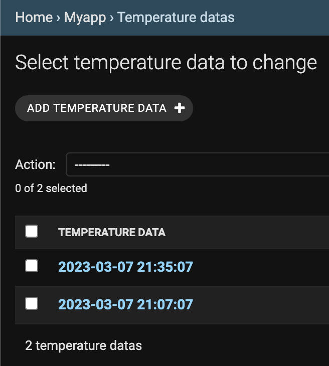
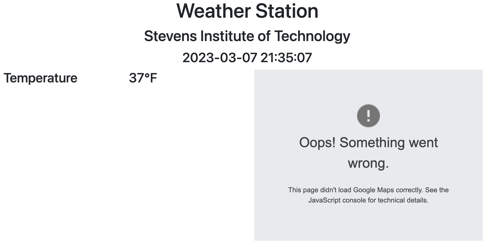
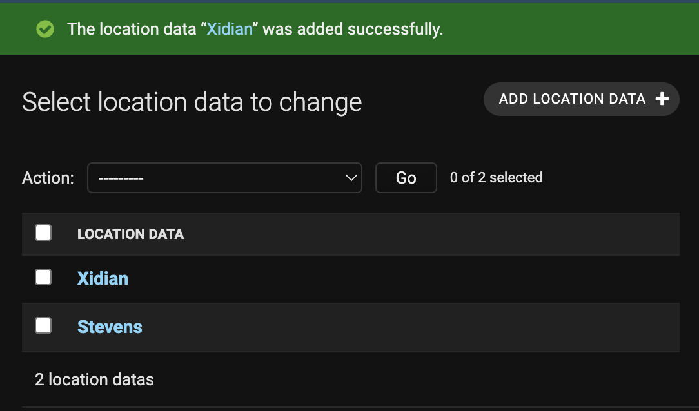
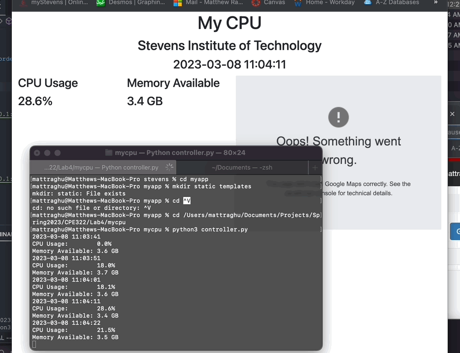
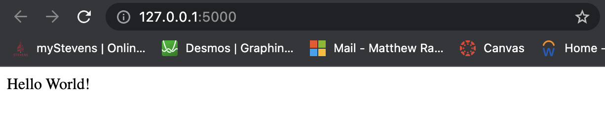

# Lab 4 : Django and Flask

## Part 1: Installing Django, Django REST Framework, and Flask

This part involves installing Django, Django REST Framework, and Flask. This is done simply by using pip to install the packages. The following commands are used to install the packages:

```bash
pip install setuptools
pip install django
pip install djangorestframework
pip install flask
pip install django-filter
pip install markdown
pip install requests
```

## Part 2: Temperature Project

This part involves creating a project with Django and utilizing **stevens** project on the [IOT](https://github.com/kevinwlu/iot/tree/master/lesson4) repository to create a web interface to display the temperature data. The following commands are used to create the project:

A blank project is created and then an app is created within the project with the following commands:

```bash
django-admin startproject stevens
python3 manage.py startapp myapp
```

Some of the settings in the **settings.py** file are changed as follows:

```python
ALLOWED_HOSTS = ['*'] # Allows all hosts to access the server


INSTALLED_APPS = [
    'django.contrib.admin',
    'django.contrib.auth',
    'django.contrib.contenttypes',
    'django.contrib.sessions',
    'django.contrib.messages',
    'django.contrib.staticfiles',
    'myapp', #Added myapp to the list of installed apps
]
```

The following files were copied from the IOT repository to the project:

- **urls.py** : ~/stevens/stevens/urls.py
- **admin.py** : ~/stevens/myapp/admin.py
- **views.py** : ~/stevens/myapp/views.py
- **models.py** : ~/stevens/myapp/models.py
- **index.html** : ~/stevens/myapp/templates/myapp/index.html
- **\*.css** : ~/stevens/myapp/static/myapp/\*.css
- **\*.js** : ~/stevens/myapp/static/myapp/\*.js
- **favicon.ico** : ~/stevens/myapp/static/favicon.ico

Using these commands, the database is created and the superuser is created:

```bash
python3 manage.py makemigrations myapp
python3 manage.py migrate
python3 manage.py createsuperuser
```

The Django server is started with the following command:

```bash
python3 manage.py runserver
```

Temperature data was manual entered in the admin panel at the following URL: http://127.0.0.1:8000/admin/

The following is a screenshot of the admin panel:


The Webpage was then accessed at the following URL that was created by Django: http://127.0.0.1:8000/

The following is a screenshot of the webpage:


Note that the map is not working because the API key is not set.

## Part 3: CPU Project

This project involves using the mycpu project from the IOT Repository to create a web interface to display live CPU data.
The steps are the same for the above project except that the following files were copied from the IOT repository to the project:

- **controller.py** : ~/mycpu/controller.py

Also 'rest_framework' was added to the end of the list of installed apps in the **settings.py** file.

After the super user is created and the server is started, location data was entered in the admin panel at the following URL: http://127.0.0.1:8000/admin/

The following is a screenshot of the admin panel:


The following values were then posted at the following URL:

- 2022 : http://127.0.0.1:8000/dt
- 20 : http://127.0.0.1:8000/cpu
- 20 : http://127.0.0.1:8000/mem

CPU Usage was published live by running the controller.py file in the terminal with the following command:

```bash
python3 controller.py
```

The webpage was then accessed at the following URL: http://http://127.0.0.1:8000/home

The following is a gif of the webpage publishing live CPU usage:


Note that the map is not working because the API key is not set (same as above).

## Part 4: Flask Project

Flask is a micro web framework for Python. It is used to create web applications. It was installed using pip:

```bash
pip install flask
```

The file **hello_world.py** from the IOT repository was copied to the project directory and ran using:

```bash
python3 hello_world.py
```

This started a server at the following URL: http://127.0.0.1:5000/



## Conclusion

Django and Flask seems like very powerful methods for creating web applications. Django may be a bit more complicated to use than Flask, but it seems to have more features. Flask seems to be more lightweight and easier to use. If I ever need to create a web application, I will consider using either depending on the complexity of the project.
