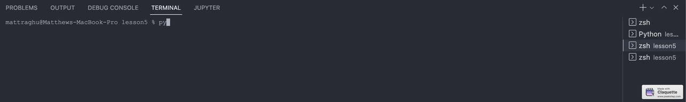

# Lab 5 : Paho-MQTT

Paho is a library that allows you to connect to an MQTT broker to publish messages. In this lab, I will be using the Paho library to publish and recieve messages from the MQTT broker.

## Part 1: Installing Paho

Paho was installed simply by using the following command:

```bash
pip3 install paho-mqtt
```

Additionally, the (IOT Repository)[https://github.com/kevinwlu/iot/tree/master/lesson5] was cloned to my local machine and **iot/lesson5** was copied to this lab's directory.

## Basic Subscribe and Publish Program

The **/lesson5** directory contains a basic subscribe and publish program. The publish program publishes a message to the topic **/test** and the subscribe program subscribes to the topic **/test**. The publish program is run first and then the subscribe program is run. The subscribe program will recieve the message from the publish program and print the topic and message to the console with the following command:

```python
print(msg.topic+" "+str(msg.payload.decode()))
```

The programs were run in seperate terminals with the following commands:

### Publish

```bash
python3 pub.py
```

### Subscribe

```bash
python3 sub.py
```

A gif of the output is shown below:


The **sub-multiple.py** and **pub-multiple.py** programs are similar to the **sub.py** and **pub.py** programs except that they publish and subscribe to multiple topics. A demonstration of the program is shown below:


## Publishing Live CPU Usage

The **pubcpu.py** program publishes the CPU usage of the machine. The program uses the **psutil** library to get the CPU usage. It makes use of the `mqtt.Client()` class to connect to the MQTT broker and publish the CPU usage via a loop.

The program is demonstrated below:

