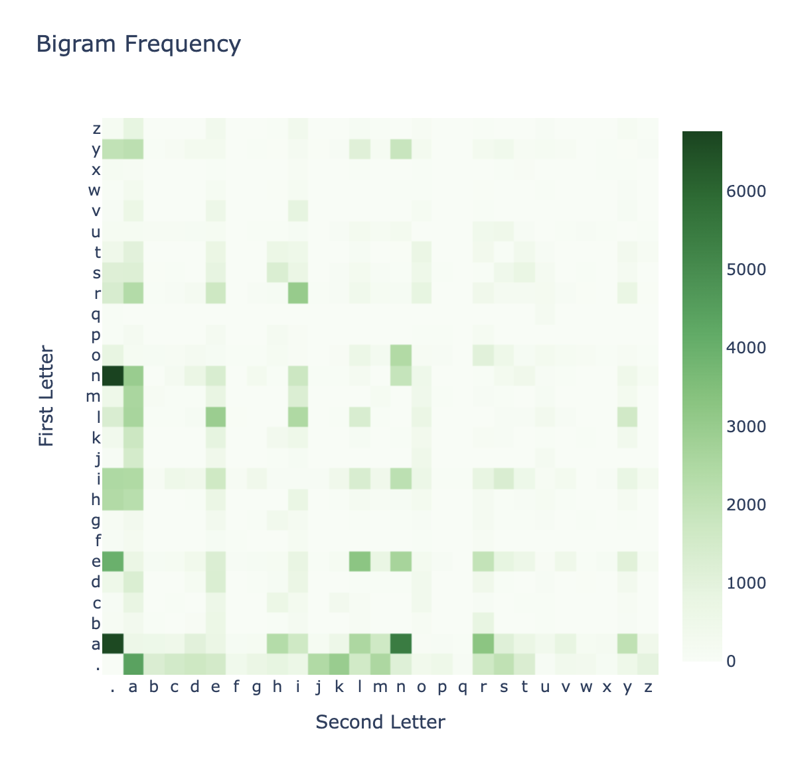
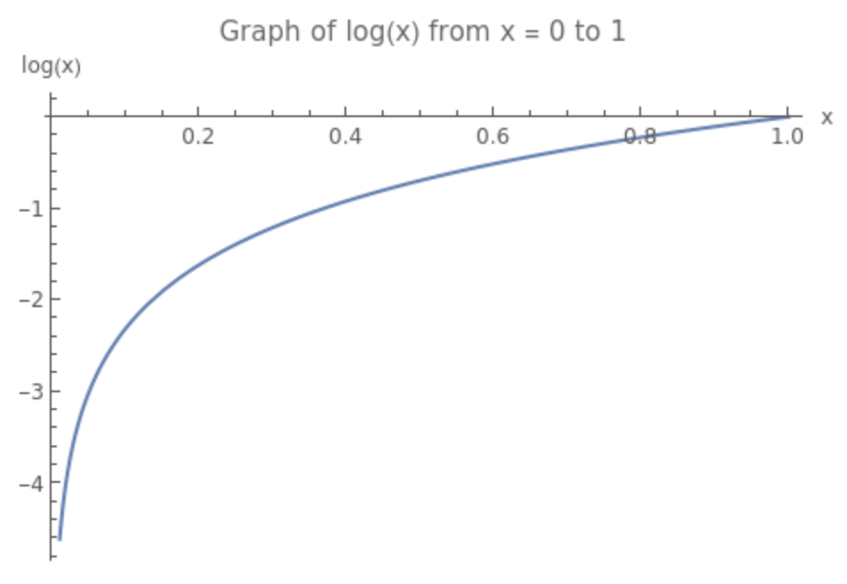
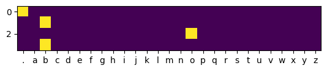

# Lab 8 : Building Makemore

## Introduction

For this lab, I decided to take it as an opportunity to learn something new. I always wanted to learn how to make complex neural networks, and I thought this would be a good chance. You don't have to read the entire thing, I just documented so I could remember what I did.

Andrej Karpathy is the (now former) director of AI at **Tesla**. He has a youtube channel where he teaches about neural networks and machine learning. I previously watched his video on [The spelled-out intro to neural networks and backpropagation: building micrograd](https://www.youtube.com/watch?v=VMj-3S1tku0&t=4s), and I decided to continue learning by creating a neural network based on his video: [The spelled-out intro to language modeling: building makemore](https://www.youtube.com/watch?v=PaCmpygFfXo)

For this project, I'm provided with a list of names (see **index.txt**) and I'm supposed to create a neural network that can generate new names based on the names in the list.

# Method 1: Basic Bigram Model

## Introduction

Essentially a bigram will predict the next letter based on the previous letter. Its a very simple model, but its a good starting point for learning how to make neural networks.

This method will not use a neural network.

## Explanation

---

We begin by loading the dataset and creating a tokenizer to convert the names into a list of numbers.

```python
#Load up names.txt
words = open('names.txt', 'r').read().split('\n')

chars = sorted(list(set(''.join(words))))

#Add "." to the beggining of the list (This will be used to indicate the start/end of a name)
chars = ['.'] + chars

#Tokenize the text- This will be used to convert the text to numbers
char_to_idx = {ch:i for i,ch in enumerate(chars)}
idx_to_char = {i:ch for i,ch in enumerate(chars)}
```

Indexing char_to_idx will give us the index of the character in the list, and indexing idx_to_char will give us the character at the index.

---

Now I create a tensor with the frequencies of every bigram in the dataset. This will be used to calculate the probability of a letter occuring after another letter.

```python
#Create a tensor of the bigram frequencies
freq_tensor = torch.zeros(len(chars), len(chars))

for w in words[:]:
    chs = ['.'] + list(w) + ['.']
    #We want to get chars 1,2 then 2,3 then 3,4 ...
    for ch1, ch2 in zip(chs, chs[1:]):
        # print(ch1, ch2)
        # b = (ch1, ch2)
        #Convert to numbers
        b = (char_to_idx[ch1], char_to_idx[ch2])

        freq_tensor[b[0], b[1]] += 1

```

Ex. if the only word in the data set was "bob", then the tensor would look like this:

|     | .   | b   | o   |
| --- | --- | --- | --- |
| .   | 0   | 1   | 0   |
| b   | 1   | 0   | 1   |
| o   | 0   | 1   | 0   |

---

I then create a graph (just to visualize the data) of the bigram frequencies.

```python
# Get list of letters and their frequencies
letters = sorted(list(set(chars)))
freqs = freq_tensor.numpy()

# Create heatmap
fig = go.Figure(data=go.Heatmap(
                   z=freqs,
                   x=letters,
                   y=letters,
                   colorscale='Greens',
                   zmin=0,
                   zmax=np.max(freqs),
                   hovertemplate='Frequency: %{z}<extra></extra>'))
fig.update_layout(
    title='Bigram Frequency',
    xaxis_title='Second Letter',
    yaxis_title='First Letter',
    width=600,
    height=600,
)
fig.show()

```



---

Now if we're given a letter, we can index the tensor to get the frequencies of the letters that come after it. We can then normalize the frequencies to get the probability of each letter occuring after the given letter.

Then we just need to sample from the probability distribution to get the next letter.

```python
g = torch.Generator().manual_seed(2147483647)

for i in range(20):
    ix = 0
    out = []
    while True:
        #Get the probabilities of the next letter based on the previous letter
        p = freq_tensor[ix]
        #Normalize the probabilities
        p = p / p.sum()
        #Generate a random letter based on the probabilities in p and a first letter
        ix = torch.multinomial(p, 1, replacement=True, generator=g).item()
        #Get the letter
        out.append(idx_to_char[ix])
        if idx_to_char[ix] == '.':
            break

    print(''.join(out[:-1]))

```

Output:

```
cexze
momasurailezitynn
konimittain
llayn
ka
da
staiyaubrtthrigotai
moliellavo
ke
teda
ka
emimmsade
enkaviyny
ftlspihinivenvorhlasu
dsor
br
jol
pen
aisan
ja
```

Note: As Kapathy says, the Bigram model is really terrible because it only has the context of a single letter without any notion of what came before it. Though this is much more "namelike" than if we didn't use the model.

For example if I were to change the p to a uniform distribution (all letters have the same probability of occuring with the following line:

```python
#Test- Create a uniform distribution
p = torch.ones(len(chars)) / len(chars)
```

Then the output would be:

```
loufqqtlyvpodqutigkysohlvohycqucacflvjjapklabqlveaamvlx
zcexvgxhfykobe
eitrrrlxhiordgopzdsy
ttnzpkumzqjjqtubeybwdzetvozddkmsvkzfzfvqxmnafpjfnamhokcdcpgvludiclojbghjoyyauaufnwwvdltswcr
awocteegebavdjlcebdfnnvkobilvxjbagvoyhbpsizsbdsoiwepwglormndgcmpmjjzrty
pdynuklhljxktriqqkrrk
spqphdoproqfiwagujj
fgkx
yuypfdgzscvkbrluyxbvzfyt
ffijvobtdkduqwcrdpcboitmxottbfqamaaofmql
cypbheriuglgfzetifjfgvyieqqnvaipbiniugz
wttvevvsuewbpsibkusrnkcwjihumtlngwdlzq
ydfovsrxixeheimvwrtfkornkolzcqwyxhhinirxnirwipciqxhakfxxjpipctdibhxobavkkibdihtflynv
ztuhexiyeciwjerkyfylkbbphdyoquptttnwfxydspkyqmcqafcxgjzmzjyoljwinirlupxijtlwidoavegjelswcomthaphnsbydjttbjlaxdrcaplxamiahcyyrmbioliogpkkwzdufbifxdzkhokwzcymqdcbzlkvbulzdawfmya
xhgupough
lob
yyihftbpqh
p
kzywhlmrarfsfhizsqeyygabjkinpbkgqshpuwsckmabxbbhhjmvywcnzenyigpnovlfakvfyyjyyohdixqiaszgjouevgklrpcykwrgepkdwfohrm
mqxjeciawzdcslpm
```

Which is much less "namelike" than the output from the bigram model.

### Loss Function

Goal is to minimize the loss function.

We calculate loss by taking the negative log of the probability of the correct letter.

I create first create a prob_tensor that give the probability of each letter occuring after a given letter instead of the frequency.

```python
    #Create a prob_tensor with the probabilities so we dont have to keep calculating them
    prob_tensor = freq_tensor / freq_tensor.sum(dim=1, keepdim=True)
```

- Now if we go and look at a random word from the dataset, we can what our model _thinks_ the probability of each letter pair is.

- In an ideal model, the probability would be close to 1.
- For example, if the only word was "Bob" and we were looking at the probability of "o" occuring after "b", then the probability would be close to 1.
- If our model was not trained and it was not close to one then we would know that our model is not very good.

To create our loss function we will start by taking the log of the probability of the correct letter.

We take the log because of the following mathematical property:

$$log(a*b) = log(a) + log(b)$$

This property allows us to add the log of the probabilities instead of multiplying them.

The log function is plotted below:


As you can see, the log function appraoches negative infinity as x approaches 0 and approaches 0 as x approaches 1.

We take the negative log because of tradition (higher loss is bad, lower loss is good).

The code for this is shown below:

```python
log_likelihood = 0
n = 0
for w in words[:]:
    chs = ['.'] + list(w) + ['.']
    #We want to get chars 1,2 then 2,3 then 3,4 ...
    for ch1, ch2 in zip(chs, chs[1:]):
        # print(ch1, ch2)
        # b = (ch1, ch2)
        #Convert to numbers
        b = (char_to_idx[ch1], char_to_idx[ch2])

        prob = prob_tensor[b[0], b[1]]
        log_prob = torch.log(prob)

        log_likelihood += log_prob
        n += 1

        # print(f'{ch1} -> {ch2}: {prob:.4f} {log_prob:.4f}')

        freq_tensor[b[0], b[1]] += 1

log_likelihood /= -n
print(f'Log Likelihood: {log_likelihood:.4f}')
```

# Method 2: Neural Network

Now I am going to replicate the bigram model using a neural network.

## Introduction

Essentially, a neural network is a function that takes in some input and produces some output.


- The neural network is made up of layers.
- Each layer is made up of neurons.
- Each neuron takes in some input and by applying some function to the input, produces some output.
- That function is made up of weights and biases and takes the following form:
  - $$y = f(\sum_{i=1}^{n} w_i x_i + b)$$
  - Where:
    - $y$ is the output
    - $f$ is the activation function
    - $w_i$ is the weight of the $i^{th}$ input
    - $x_i$ is the $i^{th}$ input
    - $b$ is the bias
    - $n$ is the number of inputs
- The goal of training a neural network is to find the weights and biases that minimize the loss function.

## Explanation

### Defining the Inputs and Targets

For our code, I start defining the inputs and targets for our neural network.

```python
xs, ys = [], [] #xs are the inputs and ys are the targets

for w in words[:1]:
    chs = ['.'] + list(w) + ['.']
    #We want to get chars 1,2 then 2,3 then 3,4 ...
    for ch1, ch2 in zip(chs, chs[:]):
        # print(ch1, ch2)
        # b = (ch1, ch2)
        #Convert to numbers
        b = (char_to_idx[ch1], char_to_idx[ch2])

        xs.append(b[0])
        ys.append(b[1])

xs = torch.tensor(xs)
ys = torch.tensor(ys)
```

### One Hot Encoding

Then I encode the inputs by using one hot encoding.

```python
x_enc = F.one_hot(xs, num_classes=len(chars)).float()
plt.imshow(x_enc)

#Convert the x axis to letters
plt.xticks(range(len(chars)), labels=chars)
plt.show()
```

This creates a tensor that has a 1 in the column of the letter and 0's everywhere else shown below:


This particular tensor is for the name, ".bob."

### Calculating the probabilities

As mentioned before, you can calculate the output for a single neuron by multiplying the inputs by the weights and adding the bias.

We can achieve a similar result by multiplying the inputs by a matrix of weights and adding a vector of biases.

Say I have this matrix of inputs with a vocabulary size of 3 **(.,b,o)** for the word "bob":

$$
x =
\begin{bmatrix}
    1 & 0 & 0 \\
    0 & 1 & 0 \\
    0 & 0 & 1 \\
    0 & 1 & 0 \\
\end{bmatrix}
$$

And I have this matrix of weights with a vocabulary size of 3 **(.,b,o)**

$$
w =
\begin{bmatrix}
    w_{..} & w_{.b} & w_{.o} \\
    w_{b.} & w_{bb} & w_{bo} \\
    w_{o.} & w_{ob} & w_{oo} \\
\end{bmatrix}
$$

Then I can calculate the output by multiplying the inputs by the weights:

$$
xw =
\begin{bmatrix}
    1 & 0 & 0 \\
    0 & 1 & 0 \\
    0 & 0 & 1 \\
    0 & 1 & 0 \\
\end{bmatrix}
\begin{bmatrix}
    w_{..} & w_{.b} & w_{.o} \\
    w_{b.} & w_{bb} & w_{bo} \\
    w_{o.} & w_{ob} & w_{oo} \\
\end{bmatrix}

=
\begin{bmatrix}
    w_{..} & w_{.b} & w_{.o} \\
    w_{b.} & w_{bb} & w_{bo} \\
    w_{o.} & w_{ob} & w_{oo} \\
    w_{b.} & w_{bb} & w_{bo} \\
\end{bmatrix}


$$

The calculation for some of the output indexes are shown below:

$$
xw[0][0] = w_{..} * 1 + w_{b.} * 0 + w_{o.} * 0 = w_{..}
$$

$$
xw[0][1] = w_{.b} * 1 + w_{bb} * 0 + w_{ob} * 0 = w_{.b}
$$

$$
xw[0][2] = w_{.o} * 1 + w_{bo} * 0 + w_{oo} * 0 = w_{.o}
$$

- It can be seen that each output corresponds to the weight that the column character follows the row character.

- For the first row, the character is "." and the first output is the weight that the next char will be ".", the next is the weight it'll be "b" and the last is "o".

A method called the **softmax** function is used to convert the outputs into probabilities.

The softmax function is defined as:

$$
\sigma(z)_j = \frac{e^{z_j}}{\sum_{k=1}^{K} e^{z_k}}
$$

Where:

- $z$ is the input
- $j$ is the index of the output
- $K$ is the number of outputs

In otherwords, I exponentiate each output and divide it by the sum of all the exponentiated outputs for that row.

$$
\sigma(xw) =

\begin{bmatrix}
\frac{e^{w_{..}}}{e^{w_{..}} + e^{w_{.b}} + e^{w_{.o}}} & \frac{e^{w_{.b}}}{e^{w_{..}} + e^{w_{.b}} + e^{w_{.o}}} & \frac{e^{w_{.o}}}{e^{w_{..}} + e^{w_{.b}} + e^{w_{.o}}} \\

\frac{e^{w_{b.}}}{e^{w_{b.}} + e^{w_{bb}} + e^{w_{bo}}} & \frac{e^{w_{bb}}}{e^{w_{b.}} + e^{w_{bb}} + e^{w_{bo}}} & \frac{e^{w_{bo}}}{e^{w_{b.}} + e^{w_{bb}} + e^{w_{bo}}} \\

\frac{e^{w_{o.}}}{e^{w_{o.}} + e^{w_{ob}} + e^{w_{oo}}} & \frac{e^{w_{ob}}}{e^{w_{o.}} + e^{w_{ob}} + e^{w_{oo}}} & \frac{e^{w_{oo}}}{e^{w_{o.}} + e^{w_{ob}} + e^{w_{oo}}} \\
\end{bmatrix}
$$

For the entire data set, the code that will calculate this is

```python
W = torch.randn(len(chars), len(chars), requires_grad=True, generator=g) #Initialize the weights randomly

logits = x_enc @ W #Log Counts

#Softmax - Convert to probabilities
counts = torch.exp(logits) #Counts
probs = counts / counts.sum(dim=1, keepdim=True) #Probabilities
```

## Loss Function

The loss function is the same as above and thus can be calculating by taking the negative log of the probabilities of the correct characters (a low probability of the correct character will result in a high loss).

This is for a single example (".bob."):

```python
#For the first character "." what is the probability of the next character being the correct character ("b")

#Get correct character
ch = ys[0].item()
print("Correct Character: ", idx_to_char[ch])

#Get probability of the correct character
prob = probs[0, ch]
print("Probability of Correct Character: ", prob.item())

#Right now it's really low because we haven't trained the model yet.

#Let's calculate loss for this example
loss = -torch.log(prob)
print("Loss: ", loss.item())
```

Output:

```
Correct Character:  b
Probability of Correct Character:  0.012314035557210445
Loss:  4.397015571594238
```

## Training

Torch keeps track of each operation that is performed on a tensor. This is called the **computation graph**.

We can use this feature to calculate the gradients of the loss function with respect to the weights.

$$
\frac{\partial L}{\partial w_{ij}} = \frac{\partial L}{\partial \sigma(z)_j} \frac{\partial \sigma(z)_j}{\partial z_j} \frac{\partial z_j}{\partial w_{ij}}
$$

Where:

- $L$ is the loss function
- $w_{ij}$ is the weight at row $i$ and column $j$
- $z_j$ is the input to the softmax function at index $j$
- $\sigma(z)_j$ is the output of the softmax function at index $j$

Luckily we don't have to calculate this by hand. We can use the `backward()` method to calculate the gradients for us.

```python
#Backward Pass
W.grad = None #Sets the gradient to zero
loss.backward() #Calculates the gradients
```

Now each weight has a gradient associated with the way it affects the loss function.

If the gradient for a param is negative, then increasing the param will decrease the loss function and vice versa.

We want to decrease loss so go in the opposite direction of the gradient.

```python
#Update the weights based on the gradients
W.data -= 0.3 * W.grad.data
```

Running this should decrease loss, which it does

## Final Result

The entire thing is put into a loop. The final program is:

```python
#Get the inputs and targets
#Ex. for ".bob.", x[0] = ".", y[0] = "b" b/c we want to predict the next character

xs, ys = [], [] #xs are the inputs and ys are the targets

for w in words[:]:
# for w in ["bob"]:
    chs = ['.'] + list(w) + ['.']
    #We want to get chars 1,2 then 2,3 then 3,4 ...
    for ch1, ch2 in zip(chs, chs[1:]):
        # print(ch1, ch2)
        # b = (ch1, ch2)
        #Convert to numbers
        b = (char_to_idx[ch1], char_to_idx[ch2])

        xs.append(b[0])
        ys.append(b[1])

xs = torch.tensor(xs)
ys = torch.tensor(ys)

#Encode the data
x_enc = F.one_hot(xs, num_classes=len(chars)).float()

#Initialize the weights randomly
g = torch.Generator().manual_seed(2147483647)
W = torch.randn(len(chars), len(chars), requires_grad=True, generator=g)

#Gradient Descent
for i in range(1000):
    #Forward Pass
    logits = x_enc @ W #Log Counts
    probs = torch.exp(logits) / torch.exp(logits).sum(dim=1, keepdim=True) #Probabilities
    loss = -torch.log(probs[torch.arange(len(xs)), ys]).mean() #Calculate loss

    #Backward Pass
    W.grad = None #Sets the gradient to zero
    loss.backward() #Calculates the gradients

    #Update the weights based on the gradients
    W.data -= 20 * W.grad.data

    if i % 100 == 0:
        print(f'Loss: {loss:.4f}')
```

What we've essentially done is replicate the behavior of the Basic Bigram Model after running the program till the loss get close to the loss of the Basic Bigram Model (it cant get any better)

If I print out the prob of b following . for both models I get similar results:

```python
#Get the prob of .b
NN_Prob = torch.exp(W[0,1]) / torch.exp(W[0]).sum() #Prob of .b from the neural network
Basic_Prob = freq_tensor[0,1] / freq_tensor[0].sum() #Prob of .b from the basic model
print("Neural Network Prob: ", prob.item())
print("Basic Prob: ", Basic_Prob.item())
```

Output:

```
Neural Network Prob:  0.13766393065452576
Basic Prob:  0.13767053186893463
```

---

I can get the some random names now by tweaking the script from the previous section:

```python
g = torch.Generator().manual_seed(2147483647)

for i in range(20):
    ix = 0
    out = []
    while True:
        #Get the probabilities of the next letter based on the previous letter
        p = torch.exp(W[ix]) / torch.exp(W[ix]).sum()

        #Generate a random letter based on the probabilities in p and a first letter
        ix = torch.multinomial(p, 1, replacement=True, generator=g).item()
        #Get the letter
        out.append(idx_to_char[ix])
        if idx_to_char[ix] == '.':
            break

    print(''.join(out[:-1]))
```

Which produces the same result (b/c its the same seed):

```
cexze
momasurailezitynn
konimittain
llayn
ka
da
staiyaubrtthrigotai
moliellavo
ke
teda
ka
emimmsade
enkaviyny
fobspihinivenvorhlasu
dsor
br
jol
pen
aisan
ja
```

---

# GPT Development

A script is developed using a similar model to the one above. However, it includes far more complex features such as layer normalization, self attention, and positional encoding.

## Recieving information from past characters

In order to feed information about past characters in generating the next character, we started by taking the average of all the channel layers (vocab size) like this:

```python
xbow = torch.zeros((B,T,C))
for batch in range(B):
    for context in range(T):
        xprev = x[batch, :context+1]
        xbow[batch, context] = xprev.mean(dim=0)
```

This can be done alternatively with this:

```python
tril = torch.tril(torch.ones((T,T)))
wei = torch.zeros((T,T))
wei = wei.masked_fill(tril==0, float('-inf')) # Make the 0s -inf
wei = F.softmax(wei, dim=1) # Will equal wei from the prev part (Because softmax will exponentiate the -inf to 0 and 0s to 1 and then normalize)
xbow3 = wei @ x
torch.allclose(xbow, xbow3)
```

## Self Attention
