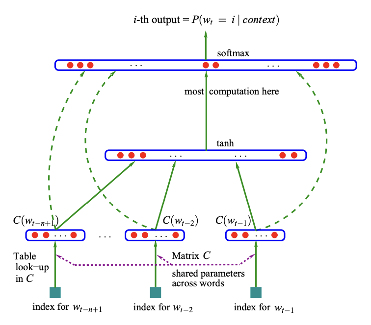
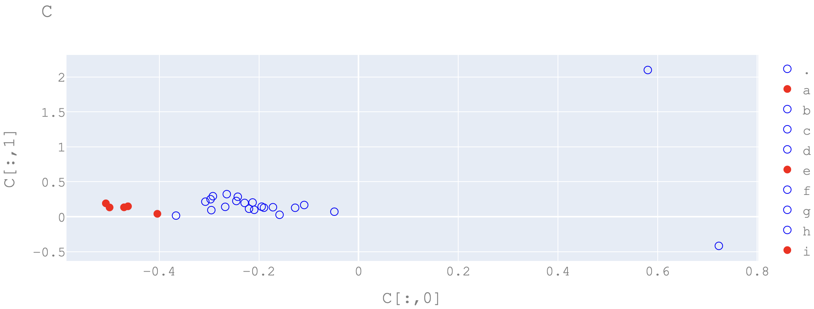

# Makemore - Multi Layer Perceptron

## Introduction

For this lab I decided to continue the makemore model that I made during Lab 9.

I always wanted to learn about machine learning and neural networks, so I decided to take this opportunity to learn about it.

I am following [this lecture](https://www.youtube.com/watch?v=TCH_1BHY58I&t=4s) by Andrej Karpathy.

## Bengio Et Al. 2003

Much of what I'm doing will follow this paper: [A Neural Probabilistic Language Model](https://www.jmlr.org/papers/volume3/bengio03a/bengio03a.pdf)

Instead of predicting the words that come next, I will be predicting the next character, attempting to generate "Name-like" words.

## Structure

The structure of the network is as follows:


## Importing the data

### Splitting the data

To ensure that the network is not built to overfit the entire dataset, I split the data into 3 parts:

- Training Data: 80%
  - Used to train the network
- Validation Data: 10%
  - Used to validate the network
- Test Data: 10%
  - Used to test the network

### Block-Size

The previous lab used a block size of 1, but I add the capability to change the block size in this lab.

The block size is the number of characters that the network will have as context to predict the next character.

### Code

```python
#Build data set
block_size = 3

def build_data_set(words):
    #Get the inputs and targets
    X, Y = [], []

    for word in words[:]:
        word = "." + word + "."
        context = [0] * block_size
        for i in range(len(word)-1):
            chr = char_to_idx[word[i]]
            context.append(chr)
            if len(context) > block_size:
                context = context[1:]
            X.append(context[:])
            Y.append(char_to_idx[word[i+1]])

            # print("For context", context, "predict", word[i+1])

    #Convert to tensor
    X = torch.tensor(X)
    Y = torch.tensor(Y)

    return X, Y

import random
random.seed(42)

#Shuffle the data
random.shuffle(words)

n1 = int(len(words)*0.8)
n2 = int(len(words)*0.9)

X_train, Y_train = build_data_set(words[:n1])
X, Y = build_data_set(words[:n1]) #Just for prev code
X_val, Y_val = build_data_set(words[n1:n2])
X_test, Y_test = build_data_set(words[n2:])
print("Train:", len(X_train), "Val:", len(X_val), "Test:", len(X_test))
```

This outputs:

```
Train: 182580 Val: 22767 Test: 22799
```

## Network Construction

### Embedding Layer (C)

The embedding layer is used almost to simplify the input into a certain number of outputs called the embedding size.

Essentially, for each possible character, there will be a certain number of outputs (embedding size) that will be used to represent that character.

To visualize what this does, I set the embedding size to two. After I ran the network and had it converge to a value of low loss, I plotted the outputs of the embedding layer on the x and y axis for each character.



As you can see, the network has learned to group similar characters together. In this case, I highlighted the vowels in red and you can see that they are very close together meaning the network will treat them similarly.

Imagine we wanted the output for the character "e" (index 5) in the embedding layer. We can do this in two ways:

```python
C = torch.randn(len(chars), 2)
C_5_A = C[5]
C_5_B = F.one_hot(torch.tensor(5), len(chars)).float() @ C

#These are the same
print("C_5_A", C_5_A) #This is faster so we will use this
print("C_5_B", C_5_B)

#Essentially we are assigning two outputs for the same input
```

### Hidden Layer (H)

The hidden layer will take the outputs from the embedding layer and process them into a certain amount of outputs- also applying an activation function (tanh) to squash the outputs between 0 and 1.

```python
#Hidden layer
W1 = torch.randn(2*block_size, 100) #2*block_size x hidden_size (up to us)
b1 = torch.randn(100) #Bias for hidden layer

#Goal: emb @ W1 + b1

#Concatenate the embeddings
#This will combine the 3rd dimension of emb into the 2nd dimension
emb = emb.view(len(X), -1) #len(X) x (block_size*2)
#The -1 means "figure out the size of this dimension for me"
print("Emb Shape: ", emb.shape)

#Now we can do the hidden layer
h = emb @ W1 + b1 #len(X) x hidden_size
h = torch.tanh(h) #Apply activation function
```

### Output Layer

The output layer will take the outputs from the hidden layer and process them into values that relate to the frequency of each character - logits.

```python
#Now we can do the output layer
W2 = torch.randn(100, len(chars)) #hidden_size x len(chars)
b2 = torch.randn(len(chars)) #Bias for output layer

#Goal: h @ W2 + b2

#Now we can do the output layer
logits = h @ W2 + b2 #len(X) x len(chars)
```

These logits are exponentiated and normalized to get the probability of each character with the **softmax** function.

$$
\sigma(z)_j = \frac{e^{z_j}}{\sum_{k=1}^{K} e^{z_k}}
$$

```python
#Calculate prob
counts = torch.exp(logits)
probs = counts / counts.sum(dim=1, keepdim=True)
```

### Loss Function

To train the network, we need a loss function to tell us how well the network is doing.

We will get all the probabilties of the correct characters (which in an ideal NN they should be close to 1 because they are correct) and take the mean of the negative log of them.

```python
#Get prob of correct characters
correct_probs = probs[range(len(X)), Y]

#Calculate loss
loss = -torch.log(correct_probs).mean()
print("Loss: ", loss)
```

## Training

### Backpropagation

To train the network, we need first find the gradient of the loss function with respect to each parameter (i.e. the way the loss changes with respect to each parameter).

Luckily PyTorch has a built in function to do this for us so we don't have to calculate the derivatives by hand:

```python
#Backward Pass
for p in parameters:
    p.grad = None

loss.backward()
```

### Gradient Descent

Now that we have the gradients, we can use them to update the parameters to minimize the loss.

```python
#Update parameters
# lr = lrs[i]
#Disable gradient tracking (for efficiency)
with torch.no_grad():
    lr = .0003
    for p in parameters:
        p.data -= lr * p.grad
```

### Full code

```python
#Put it all together
emb_dim = 10
hidden_size = 200
batch_size = 32
n = 10000

g = torch.Generator().manual_seed(2147483647) # for reproducibility
C = torch.randn(len(chars), emb_dim, generator=g)
W1 = torch.randn(emb_dim*block_size, hidden_size, generator=g)
b1 = torch.randn(hidden_size, generator=g)
W2 = torch.randn(hidden_size, len(chars), generator=g)
b2 = torch.randn(len(chars), generator=g)

parameters = [C, W1, b1, W2, b2]

for p in parameters:
    p.requires_grad_()

#Print number of parameters
num_params = 0
for p in parameters:
    num_params += p.numel()
print("Total Parameters:", num_params)

bestC = None
bestLoss = float('inf')

for i in range(n):
    #Mini-batch
    ix = torch.randint(len(X_train), (batch_size,))

    emb = C[X_train[ix]]
    emb = emb.view(len(X_train[ix]), -1) #len(X_train) x (block_size*2)
    h = emb @ W1 + b1 #len(X_train) x hidden_size
    h = torch.tanh(h) #Apply activation function
    logits = h @ W2 + b2 #len(X_train) x len(chars)
    # counts = torch.exp(logits)
    # probs = counts / counts.sum(dim=1, keepdim=True)
    # correct_probs = probs[range(len(X_train)), Y]
    # loss = -torch.log(correct_probs).mean()
    loss = F.cross_entropy(logits, Y[ix]) #This is the same as the above 4 lines
    # Forward / Backward Pass is much more efficient than the above 4 lines
    # Can account for high possitve values that would cause overflow

    #Backward Pass
    for p in parameters:
        p.grad = None

    loss.backward()

    #Update parameters
    # lr = lrs[i]
    #Disable gradient tracking (for efficiency)
    with torch.no_grad():
        lr = .0003 #This was the best learning rate without sacrificing speed
        for p in parameters:
            p.data -= lr * p.grad

    #Track Stats
    lre_i.append(lre[i])
    loss_i.append(loss.item())

    #Save best parameters
    if loss < bestLoss:
        bestLoss = loss
        # bestC = C.clone()
        # print("New Best Loss:", bestLoss.item())


    # if i % 100 == 0:
    #     print("Loss: ", loss.item())
```

## Checking for overfitting

Overfitting happens when the network is trained too much on the training data and it doesn't generalize well to the other data. That's why it's important to have a validation set to check for overfitting.

```python
#Calculate loss of validation set
emb = C[X_val]
emb = emb.view(len(X_val), -1) #len(X_val) x (block_size*2)
h = emb @ W1 + b1 #len(X_val) x hidden_size
h = torch.tanh(h) #Apply activation function
logits = h @ W2 + b2 #len(X_val) x len(chars)
loss = F.cross_entropy(logits, Y_val) #This is the same as the above 4 lines
print("Validation Loss: ", loss.item())

#Calculate loss of Training set
emb = C[X_train]
emb = emb.view(len(X_train), -1) #len(X_train) x (block_size*2)
h = emb @ W1 + b1 #len(X_train) x hidden_size
h = torch.tanh(h) #Apply activation function
logits = h @ W2 + b2 #len(X_train) x len(chars)
loss = F.cross_entropy(logits, Y_train) #This is the same as the above 4 lines
print("Training Loss: ", loss.item())

#Training Loss is close to Validation Loss so we are not overfitting.
```

```
Validation Loss:  2.1527202129364014
Training Loss:  2.115222692489624
```

## Results

### Loss

The loss was slightly less than our one layer perceptron from Lab 8. This is because the network is more complex and can learn more complex patterns.

MLP:

```
Validation Loss:  2.1527202129364014
Training Loss:  2.115222692489624
```

One Layer Perceptron:

```
Loss: 2.4559
```

Note: the other lab doesn't even have a validation set so it's not a fair comparison; yet the MLP still does better.

### Name Generation

I was able to get the network to generate names that look like names with this code:

```python
g = torch.Generator().manual_seed(2147483647)

for i in range(20):
    context = [0] * block_size
    name = "."
    while True:
        #Get the context
        context_tensor = torch.tensor(context).unsqueeze(0)
        emb = C[context_tensor]
        emb = emb.view(1, -1)
        h = emb @ W1 + b1
        h = torch.tanh(h)
        logits = h @ W2 + b2
        probs = F.softmax(logits, dim=1).squeeze(0)

        #Get the next character
        next_char = torch.multinomial(probs, 1, generator=g).item()

        #Add the next character to the name
        name += idx_to_char[next_char]

        #Update the context
        context.append(next_char)
        if len(context) > block_size:
            context = context[1:]

        if next_char == 0:
            break

    print(name[1:-1])
```

```
cex
maleah
makilah
tyha
kalimitta
noluwan
katar
samiyah
javer
got
shid
jence
kinzited
jena
mathside
enkaviyah
foble
huniven
tahlas
kaspr
```
