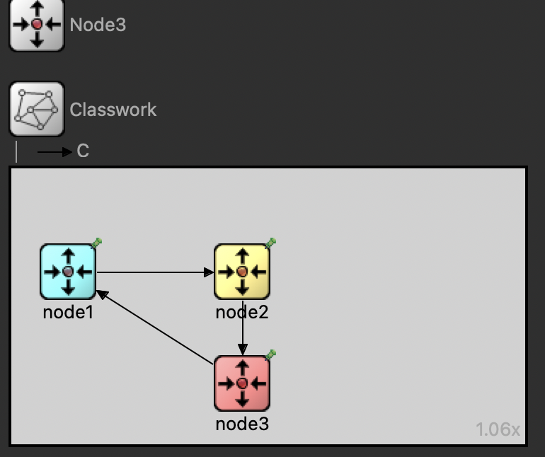
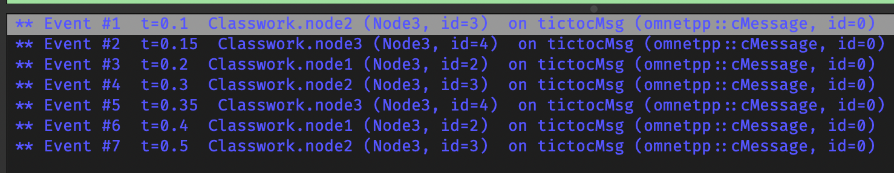
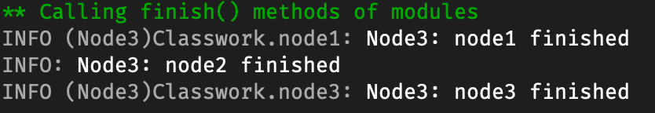

# Classwork 6

For this project we were tasked with creating a simple program in Omnett. Basically one node sends and initial message it is passed to another node which then sends it to another node and so on, until it reaches the last node which then sends it back to the first node and the cycle repeats.

## Part 1 - Structure

The structure of the nodes and their connections is shown below:



This was achieved with the following code in the _Classwork.ned_ file:

```c++
simple Node3
{
    parameters:
        @display("i=block/routing"); // add a default icon
        int num_msgs = 10;
    gates:
        input in;
        output out;
}


network Classwork
{
    @display("bgb=342,184");

    types:
        channel C extends ned.DelayChannel {
            parameters:
                @display("i=block/clock");
                delay = 50ms;
        }
    submodules:
        node1: Node3 {
            parameters:
                @display("i=,cyan;p=38,69"); // do not change the icon (first arg of i=) just colorize it
        }

        node2: Node3 {
            parameters:
                @display("i=,gold;p=154,69"); // here too
        }
        node3: Node3 {
            parameters:
                @display("i=,red;p=154,143"); // here too
        }
    connections:
        //Add a 100ms delay to the connection between node1 and node2
        node1.out --> {delay = 100ms;} --> node2.in;
        node2.out --> C --> node3.in;
        node3.out --> C --> node1.in;
}
```

## Part 2 - Node3.cc

Now the Node class is defined in the _Node3.cc_ file:

```c++
#include <omnetpp.h>

using namespace omnetpp;

class Node3 : public cSimpleModule
{
protected:
    virtual void initialize() override;
    virtual void handleMessage(cMessage *msg) override;
};

Define_Module(Node3);

void Node3::initialize()
{
    // Module initialization code here
    if (strcmp("node1", getName()) == 0)
    {
        // create and send first message on gate "out". "tictocMsg" is an
        // arbitrary string which will be the name of the message object.
        cMessage *msg = new cMessage("tictocMsg");
        send(msg, "out");
    }
}

// Handle messages arriving on gate "in"
void Node3::handleMessage(cMessage *msg)
{
    // Message processing code here
    send(msg, "out");
}
```

## Part 3 - Running the program

Now the program is run and the results are shown below:


As you can see there is a delay of 100ms between node1 and node2 and a delay of 50ms between node2 and node3 and between node3 and node1.
This is done by using the delay method of channels in the _Classwork.ned_ file.

A finish function was also added to the _Node3.cc_ file to print a final message when the simulation is finished:

```c++
// Finish function
void Node3::finish()
{
    EV << "Node3: " << getName() << " finished" << endl;
}
```

The output of this is shown below:


The activity function was not used as according to the documentation it states:

> **virtual void cSimpleModule::activity() [protected, virtual]**
> Should be redefined to contain the module activity function. For several good reasons, you should prefer handleMessage() to activity(). This default implementation issues an error message (throws cRuntimeError).
