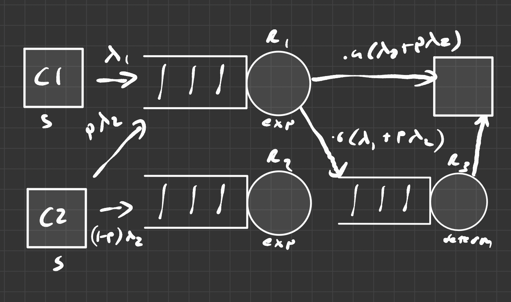
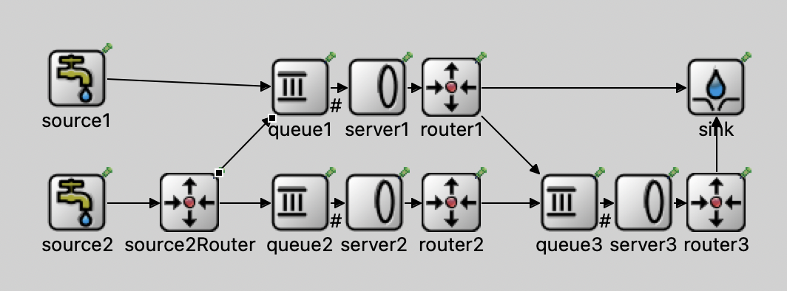
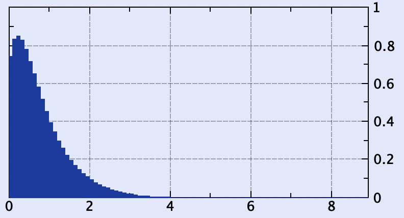

# Network of Queues

## Block Diagram

## Types of Queues

- 2x MM1 Queues
- 1x MD1 Queue

## Stability

Yes the queue is stable because for all routers, $\rho < 1$, or $\lambda < \mu$.

The calculations are shown below.

## Node Structure

## Long-Run Average Time Spent in System per Customer

### Router 1

For a M/G/1 Queue we can use the following formula to calculate the long-run average time spent in system per customer

$$w \approx \frac{1}{\mu} + \frac{\lambda\left(\frac{1}{\mu^2} + \sigma^2\right)}{2\left(1-\rho\right)}$$

Where:

- $\mu$ is the service rate
- $\lambda$ is the arrival rate
- $\rho$ is the utilization
- $\sigma^2$ is the variance of the service time

We know:
$$\mu=4$$
$$\rho = \frac{\lambda}{\mu}$$

From the diagram, we can see router 1 is effected by both source 1 and 2. So the arrival rate is $$\lambda = \lambda_1 + p*\lambda_2 = 1 + 0.2*2 = 1.4$$

Because it is an exponential distribution, the variance is equal to one over the square of the mean.

$$
\sigma^2 = \frac{1}{\mu^2} = 1/16
$$

So the formula becomes:

$$
w \approx \frac{1}{4} + \frac{1.4\left(\frac{1}{16} + \frac{1}{16}\right)}{2\left(1-\frac{1.4}{4}\right)} \approx 0.385
$$

This is close to the actual value of **0.363145** that was outputted from the **cHistogram** module.

### Router 2

The same concepts can be applied to the other routers. I won't waste time explaining the same thing again.

- $\lambda=0.8*2$
- $\mu=4$
- $\rho=\frac{\lambda}{\mu}=\frac{2}{4}=0.5$
- $\sigma^2=\frac{1}{\mu^2}=\frac{1}{16}$

$$
w \approx \frac{1}{4} + \frac{1.6\left(\frac{1}{16} + \frac{1}{16}\right)}{2\left(1-\frac{1.6}{4}\right)} \approx 0.417
$$

**Actual Value = 0.41683**

### Router 3

Router 3 recieves input from two source. 60% of Router 1's output and all of Router 2's output.

- $\lambda=0.6*(\lambda_1 + p*\lambda_2) + (1-p)*\lambda_2 = 0.6*(1+0.2*2) + (1-0.2)*2 = 2.44$
- $\mu=4$
- $\rho=\frac{\lambda}{\mu}=\frac{2.44}{4}$
- $\sigma^2=0$ (because it's a deterministic service time)

$$
w_3 \approx \frac{1}{4} + \frac{2.44\left(\frac{1}{16}\right)}{2\left(1-\frac{2.44}{4}\right)} \approx 0.446
$$

This value of $w$ does not take in account the time spent in the queue from the prior routers. So we need to add it to the weighted average of the $w$ values from the prior routers.

$$
w = (0.6*(1+0.2*2)/2.44)*0.385+((1-0.2)*2/2.44)*.417 + w_3 \approx 0.823
$$

**Actual Value = 0.802755**

## Entire System

The sink is used to collect the average delay for the entire system.

It recieve input from Router's 1 and 3. So the total delay is a weighted sum of the delays from each router.

$$
\lambda_{sink} = 0.4\lambda_{R1} + \lambda_{R3}
$$

$$
w_{sink} = \frac{0.4\lambda_{R1}w_{R1} + \lambda_{R3}w_{R3}}{\lambda_{sink}}
$$

$$
\lambda_{R1} = \lambda_1 + p*\lambda_2 = 1 + 0.2*2 = 1.4
$$

$$
\lambda_{R3} = 0.6*(\lambda_1 + p*\lambda_2) + (1-p)*\lambda_2 = 0.6*(1+0.2*2) + (1-0.2)*2 = 2.44
$$

- $w_{R1} = 0.385$
- $w_{R3} = 0.823$

This calculates to:

$$
w_{sink} = \frac{0.4*1.4*0.385 + 2.44*0.823}{1.4*0.4 + 2.44} \approx 0.741
$$

**Actual Value = 0.822**

## Code

The code can be found at [my GitHub repo](https://github.com/mattraghu/Spring2023/tree/master/CPE345/Classwork8).
