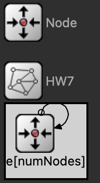
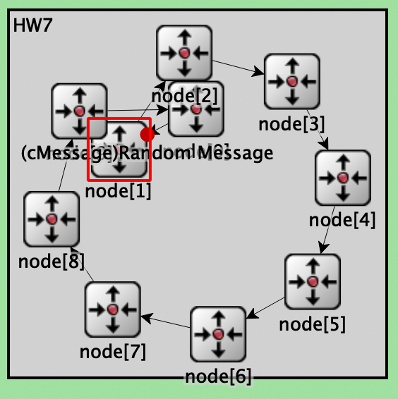

# Homework 7

For this assignment we were tasked with designing a simple program that passes a message between 10 nodes 10 times.

## Structure

The system is structured as follows:



This is achieved with the following code in the **HW7.ned** file.

```c++
simple Node {
    parameters:
        @display("i=block/routing");
        // bool isSource @default(false);
    gates:
        input in;
        output out;
}

network HW7 {
    parameters:
        int numNodes @default(10);
    submodules:
        node[numNodes]: Node {
        }
    connections:
        // connect the nodes
        for i=0..numNodes-2 { //connect up until the last node
            node[i].out --> node[i+1].in;
        }
        node[numNodes-1].out --> node[0].in; // connect the last node to the first
}
```

## Module Code

The code for the module is as follows:

```c++
#include <omnetpp.h>

using namespace omnetpp;

class Node : public cSimpleModule
{
protected:
    virtual void initialize() override;
    virtual void handleMessage(cMessage *msg) override;
};

Define_Module(Node);

void Node::initialize()
{
    // Module initialization code here
    if (getIndex() == 0) // if this is the first node
    {
        cMessage *msg = new cMessage("Random Message");
        // Set pass count to a long value of 0
        msg->addPar("passCount").setLongValue(0);

        send(msg, "out");
    }
}

// Handle messages arriving on gate "in"
void Node::handleMessage(cMessage *msg)
{
    int passCount = msg->par("passCount");             // Get "passCount" parameter value
    msg->par("passCount").setLongValue(passCount + 1); // Increment and update "passCount"
    passCount++;
    if (passCount < 10)
    {
        EV << "Node " << getIndex() << ": This message has been passed " << passCount << " times." << endl;
        send(msg, "out");
    }
    else
    {
        // change its message to: node <index> last to receive message.
        msg->setName(("Node" + std::to_string(getIndex()) + " last to receive message.").c_str());

        // Print the message
        EV << msg->getName() << endl;
        delete msg;
    }
}
```

## Results

The results of the simulation are shown below:




The console output is shown below:

```
** Event #1  t=0  HW7.node[1] (Node, id=3)  on Random Message (omnetpp::cMessage, id=0)

INFO: Node 1: This message has been passed 1 times.
** Event #2  t=0  HW7.node[2] (Node, id=4)  on Random Message (omnetpp::cMessage, id=0)

INFO: Node 2: This message has been passed 2 times.
** Event #3  t=0  HW7.node[3] (Node, id=5)  on Random Message (omnetpp::cMessage, id=0)

INFO: Node 3: This message has been passed 3 times.
** Event #4  t=0  HW7.node[4] (Node, id=6)  on Random Message (omnetpp::cMessage, id=0)

INFO: Node 4: This message has been passed 4 times.
** Event #5  t=0  HW7.node[5] (Node, id=7)  on Random Message (omnetpp::cMessage, id=0)

INFO: Node 5: This message has been passed 5 times.
** Event #6  t=0  HW7.node[6] (Node, id=8)  on Random Message (omnetpp::cMessage, id=0)

INFO: Node 6: This message has been passed 6 times.
** Event #7  t=0  HW7.node[7] (Node, id=9)  on Random Message (omnetpp::cMessage, id=0)

INFO: Node 7: This message has been passed 7 times.
** Event #8  t=0  HW7.node[8] (Node, id=10)  on Random Message (omnetpp::cMessage, id=0)

INFO: Node 8: This message has been passed 8 times.
** Event #9  t=0  HW7.node[9] (Node, id=11)  on Random Message (omnetpp::cMessage, id=0)

INFO: Node 9: This message has been passed 9 times.
** Event #10  t=0  HW7.node[0] (Node, id=2)  on Random Message (omnetpp::cMessage, id=0)

INFO: Node0 last to receive message.

```

Note: The Node Index starts at 0, so the last node is Node 9.
