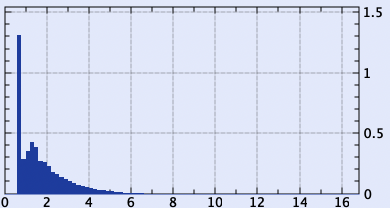
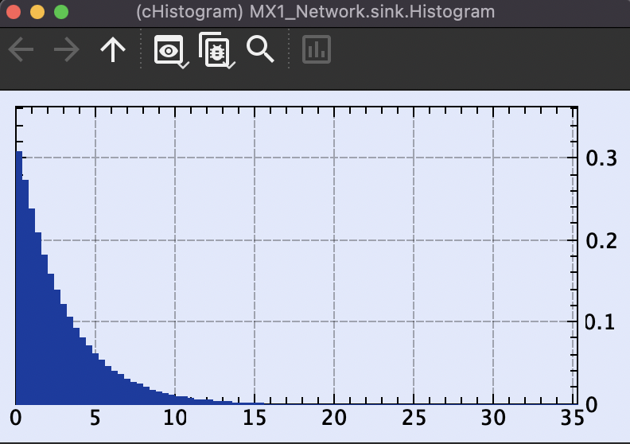

# Simulation of Queuing Networks in OMNeT++

This program has the ability to simulate both MM1 and MD1 Queues depending on which configuration is selected.

## MX1_Network.ned

```cpp
import org.omnetpp.queueing.PassiveQueue;
import org.omnetpp.queueing.Server;
import org.omnetpp.queueing.Sink;
import org.omnetpp.queueing.Source;

network MX1_Network
{
    submodules:
        server: Server {
            @display("p=213,148");
        }
        sink: My_Sink_ext {
            @display("p=316,148");
        }
        passiveQueue: PassiveQueue {
            @display("p=128,148");
        }
        source: Source {
            @display("p=54,148");
        }
    connections:
        passiveQueue.out++ --> server.in++;
        server.out --> sink.in++;
        source.out --> passiveQueue.in++;
}
```

Additionally, a custom sink module is defined to collect the long-run average time spent in system per customer. Here is the **my_Sink_ext.cc** file:

```cpp
#include "my_Sink_ext.h"

Define_Module(My_Sink_ext);

void My_Sink_ext::initialize()
{
    Sink::initialize();
    histogram.setName("Histogram");
}

void My_Sink_ext::handleMessage(cMessage *msg)
{
    Sink::handleMessage(msg);
    simtime_t delay = simTime() - msg->getCreationTime();
    histogram.collect(delay);
}
```

## omnetpp.ini

```cpp
[General]
network = MX1_Network
**.source.interArrivalTime = exponential(1.0s)
**.source.numJobs = 100000

[MD1]
network = MX1_Network
\*\*.server.serviceTime = 0.75s

[MM1]
network = MX1_Network
\*\*.server.serviceTime = exponential(0.75s)
```

## Network Visualization


## Long-Run Average Time Spent in System per Customer

### M/M/1 Queue

#### Theoretical

For a M/G/1 Queue we can use the following formula to calculate the long-run average time spent in system per customer

$$w \approx \frac{1}{\mu} + \frac{\lambda\left(\frac{1}{\mu^2} + \sigma^2\right)}{2\left(1-\rho\right)}$$

Where:

- $\mu$ is the service rate
- $\lambda$ is the arrival rate
- $\rho$ is the utilization
- $\sigma^2$ is the variance of the service time

In this case, our service rate is 1/0.75 = 1.3333, our arrival rate is 1, and our utilization is 1/1.3333 = 0.75.

For a deterministic service time, the variance is 0.

$$
w \approx \frac{1}{1.3333} + \frac{1\left(\frac{1}{1.3333^2} + 0\right)}{2\left(1-0.75\right)} \approx 1.87500001
$$

#### Simulation

The long run average time spent in system per customer is collected using the **cHistogram** module. The following is the output of the simulation:



with the following stats:


The mean, **1.87939** is very close to the theoretical value of **1.87500001**.

### M/M/1 Queue

#### Theoretical

The same formula can be used to calculate the long-run average time spent in system per customer for a M/M/1 Queue.

$$w \approx \frac{1}{\mu} + \frac{\lambda\left(\frac{1}{\mu^2} + \sigma^2\right)}{2\left(1-\rho\right)}$$

Except in this case, the service time is exponentially distributed, the variance is equal to one over the square of the mean.

$$
\sigma^2 = \frac{1}{\mu^2}
$$

So the formula becomes:

$$
w \approx \frac{1}{\mu} + \frac{\lambda\left(\frac{1}{\mu^2} + \frac{1}{\mu^2}\right)}{2\left(1-\rho\right)} = \frac{1}{\mu} + \frac{\lambda\left(\frac{2}{\mu^2}\right)}{2\left(1-\rho\right)} = \frac{1}{\mu} + \frac{\lambda}{\mu^2\left(1-\rho\right)}
$$

Where:

- $\mu = \frac{1}{0.75} = 1.3333$
- $\lambda = 1$
- $\rho = \frac{\lambda}{\mu} = \frac{1}{1.3333} = 0.75$

$$
w \approx \frac{1}{1.3333} + \frac{1}{1.3333^2\left(1-0.75\right)} \approx 3.00000057
$$

#### Simulation




The mean, **3.00487** is very close to the theoretical value of **3.00000057**, so I consider this simulation a success.

## Code

You can access the code at [my github repository](https://github.com/mattraghu/Spring2023/tree/master/CPE345/MM1)
