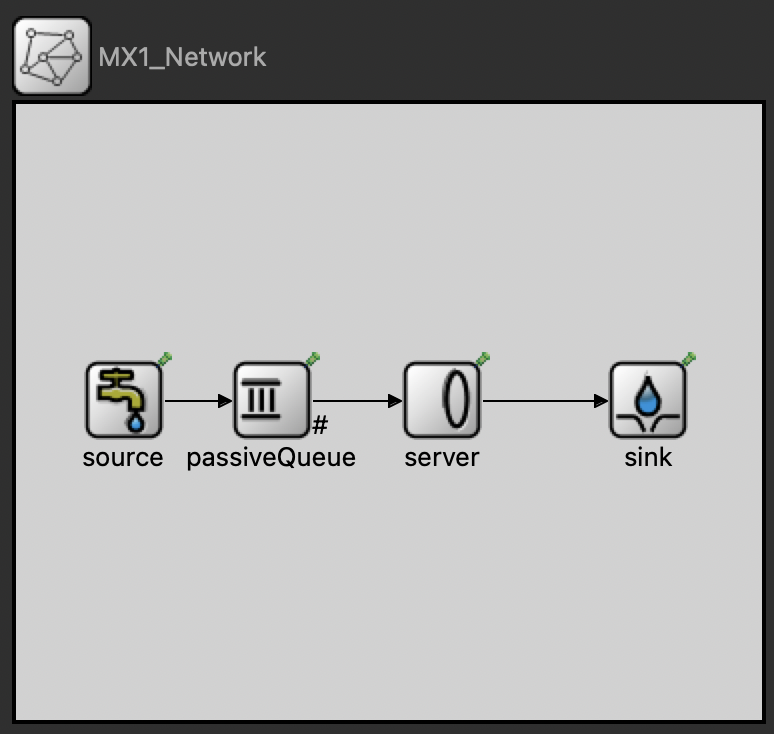

# Simulation of Queuing Networks in OMNeT++

This program has the ability to simulate both MM1 and MD1 Queues. We will focus on the MD1 Queue.

## MX1_Network.ned

```cpp
import org.omnetpp.queueing.PassiveQueue;
import org.omnetpp.queueing.Server;
import org.omnetpp.queueing.Sink;
import org.omnetpp.queueing.Source;

network MX1_Network
{
    submodules:
        server: Server {
            @display("p=213,148");
        }
        sink: Sink {
            @display("p=316,148");
        }
        passiveQueue: PassiveQueue {
            @display("p=128,148");
        }
        source: Source {
            @display("p=54,148");
        }
    connections:
        passiveQueue.out++ --> server.in++;
        server.out --> sink.in++;
        source.out --> passiveQueue.in++;
}
```

## omnetpp.ini

```cpp
[General]
network = MX1_Network
**.source.interArrivalTime = exponential(1.0s)
**.source.numJobs = 100000

[MD1]
network = MX1_Network
\*\*.server.serviceTime = 0.75s

[MM1]
network = MX1_Network
\*\*.server.serviceTime = exponential(0.75s)
```

## Network Visualization


