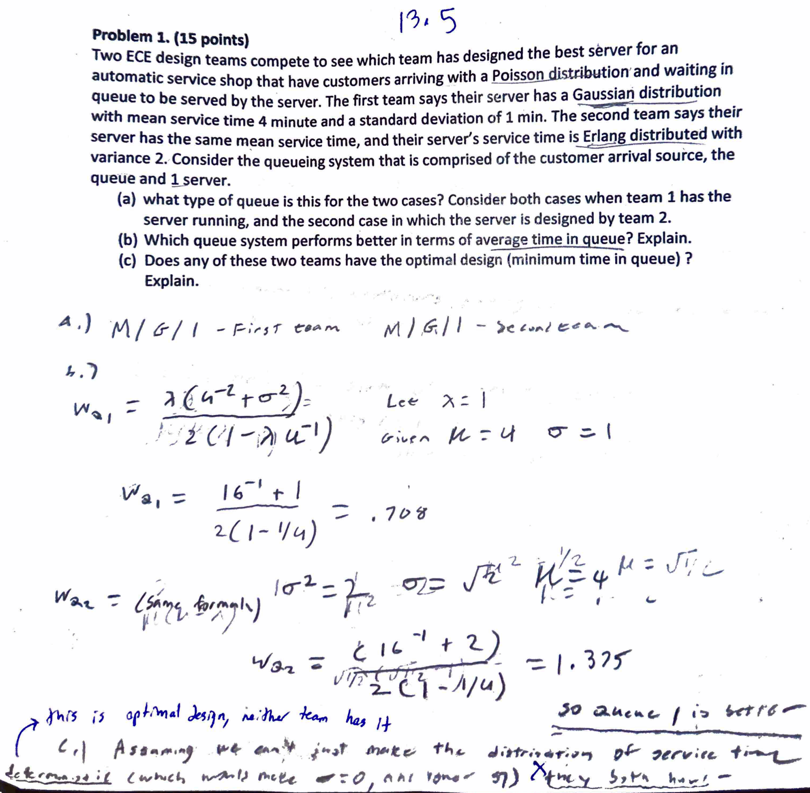
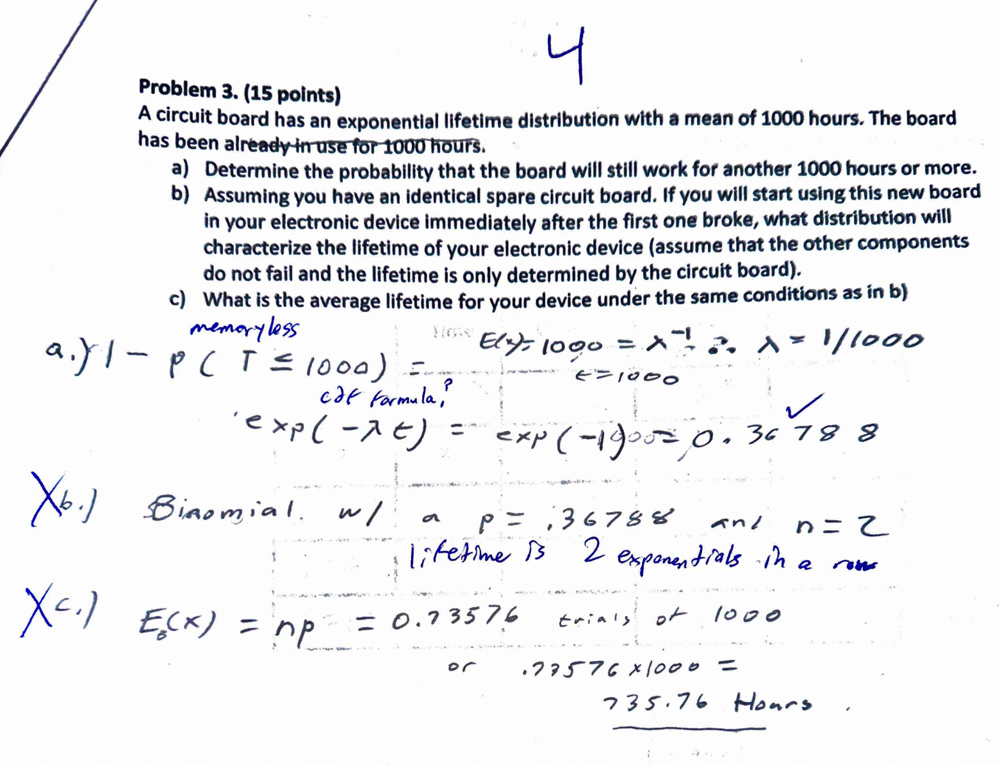
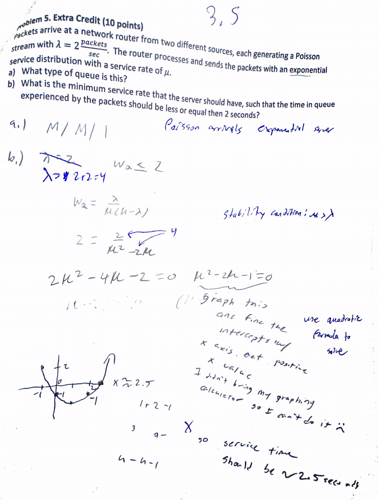

# Midterm Regrade Requests

The annnouncement had said not to email you directly, but I had a questions about other problems on the exam as well so I'll put them all in one file so it's not to troublesome.

---

<!-- 

 -->

## Problem 1 Part C

For Problem One, Part C, I wrote that they both have the optimal design because I assumed that you couldn't just magically make the service time deterministic (which I mentioned would be optimal as the variance would be zero) because I thought it would be weird to say that you can just command someone to work deterministically.

Here is the text transcribed (if it's easier to read):

> Assuming we can't just make the distribution of service time <u>deterministic</u> (which would make &sigma; = 0, and lower SD) <u>they both have</u>.

---

## Problem 3

For Problem 3, I got a whole bunch of points off cause I incorrectly said the two boards would be binomial which caused me to get part C completely wrong. I was right to calculate E(x) but I put it in the binomial formula instead of the Erlang. I feel like I should have gotten some credit for at least having the idea correct.

---

## Extra Credit

Also my extra credit was discredited by a lot simply because I missed the part of the problem that said "two different sources" and did the problem for a lambda of 2 (instead of 4). I know it's extra credit so that's probably why it was graded that harshly, but I thought I might as well ask.

---

## Conclusion

I would really appreciate it if you could look through my work. I studied pretty hard for this exam and I was really disappointed in myself for the score 🙁

Thank you for your time!

Matthew Raghunandan
