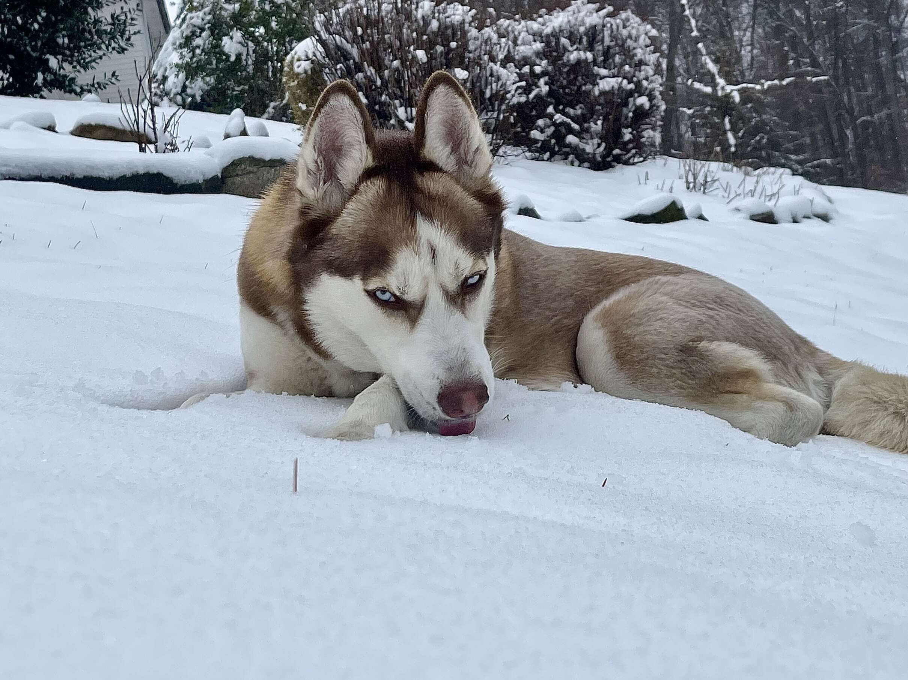
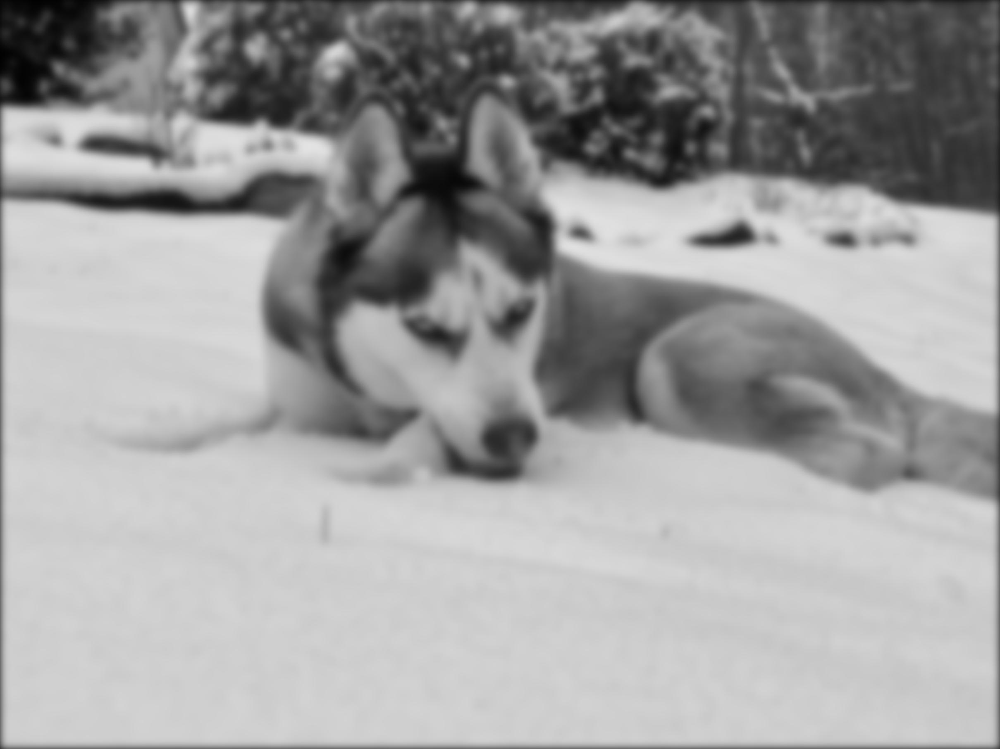
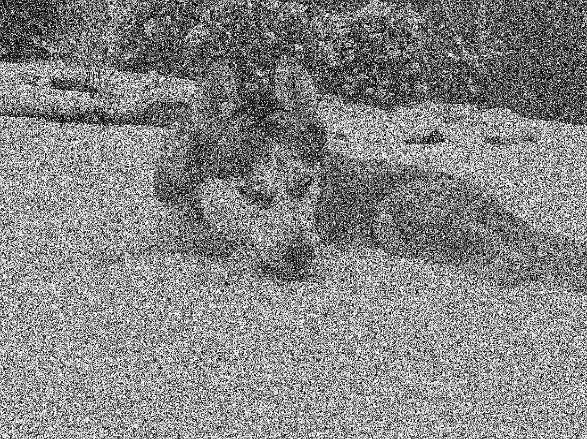
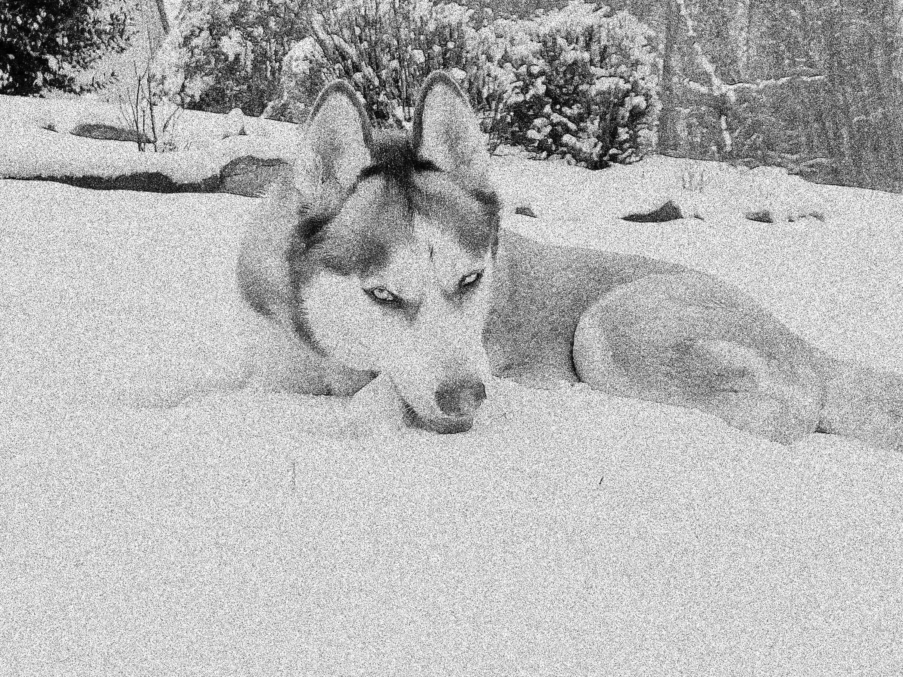
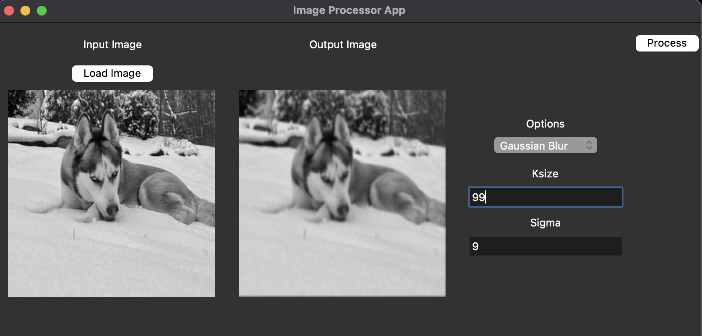

<h1 style="text-align:center;">
    Image Enchancement Algorithms
</h1>

<div style="text-align:center;">

</div>

<div >
<h2 style="text-align:center;">
    CPE 462 Final Project
</h2>

<h3 style="text-align:center;">
    Author:
    <br> Matthew Raghunandan </br>
    <br> 4/25/2023 </br>
</h3>

<div style="text-align:center;">
I pledge my Honor that I have abided by the Stevens Honor System.
</div>

# Introduction

## Abstract

This project explores various method of image enhancement. Specifically, three algorithms: Gaussian Blur, Additive White Gaussian Noise, and Speckle Noise are implemented and tested. It also features the development of a GUI that allows the user to apply these algorithms in a user-friendly way. The results show that the algorithms are effective in enhancing images, with various execution times and efficiency.

## Background

Image enhancement is a crucial aspect of digital image processing, aiming to improve the visual quality of images captured by various imaging devices. In the digital era, with the rise of social media and the increasing use of imaging devices for various applications, the need for efficient and effective image enhancement techniques has become more significant than ever. Consequently, researchers and practitioners have developed numerous image enhancement algorithms over the years to address this need.

## Problem Statement

The goal of this project is to implement and test various image enhancement algorithms. The algorithms that will be implemented are Gaussian Blur, Additive White Gaussian Noise, and Speckle Noise. The algorithms will be tested on various images to determine their effectiveness. The results will be compared to the original images to determine the effectiveness of the algorithms.

# Image Enhancement Algorithms

## Gaussian Blur

### Description

#### Mathematical Description

Gaussian blur is a simple and effective image enhancement algorithm. It is a linear filter that is used to blur an image. It is a convolution of the image with a Gaussian function. The Gaussian function is a bell-shaped curve that is used to model the distribution of a variable. The Gaussian function is defined as:

$$G(x,y) = \frac{1}{2\pi\sigma^2}e^{-\frac{x^2+y^2}{2\sigma^2}}$$

where $\sigma$ is the standard deviation of the Gaussian function.

The $$\frac{1}{2\pi\sigma^2}$$ term is a normalization factor that ensures that the Gaussian function integrates to 1.

#### Creating the Gaussian Kernel

In code, this can be represented as

```python
# Function to create a Gaussian kernel given the kernel size and standard deviation (sigma)
def create_gaussian_kernel(ksize, sigma):
    # Create a 1D array of coordinates centered at zero
    ax = np.arange(-ksize // 2 + 1., ksize // 2 + 1.)

    # Create a 2D meshgrid from the 1D array
    xx, yy = np.meshgrid(ax, ax)

    # Compute the Gaussian kernel using the meshgrid
    kernel = np.exp(-(xx**2 + yy**2) / (2. * sigma**2))

    # Normalize the kernel so that it sums to 1
    return kernel / kernel.sum()
```

Note: the normalization factor is applied when we divide the kernel by the sum of the kernel. This ensures that the kernel integrates to 1.

Say we had a 3x3 kernel,
xx,yy would be

$$xx = \begin{bmatrix} -1 & 0 & 1 \\ -1 & 0 & 1 \\ -1 & 0 & 1 \end{bmatrix}$$

$$yy = \begin{bmatrix} -1 & -1 & -1 \\ 0 & 0 & 0 \\ 1 & 1 & 1 \end{bmatrix}$$

$$G = \begin{bmatrix} e^{-\frac{(-1)^2+(-1)^2}{2\sigma^2}} & e^{-\frac{(0)^2+(-1)^2}{2\sigma^2}} & e^{-\frac{(1)^2+(-1)^2}{2\sigma^2}} \\ e^{-\frac{(-1)^2+(0)^2}{2\sigma^2}} & e^{-\frac{(0)^2+(0)^2}{2\sigma^2}} & e^{-\frac{(1)^2+(0)^2}{2\sigma^2}} \\ e^{-\frac{(-1)^2+(1)^2}{2\sigma^2}} & e^{-\frac{(0)^2+(1)^2}{2\sigma^2}} & e^{-\frac{(1)^2+(1)^2}{2\sigma^2}} \end{bmatrix}$$

The Gaussian Kernel would then be normalized by dividing by the sum of the kernel in the following line:

```python
return kernel / kernel.sum()
```

#### Convolution

We know that to apply a Gaussian Blur we have to convolve the image with the Gaussian kernel.

A 1D convolution is defined as:

$$x[n] * h[n] = \sum_{k=-\infty}^{\infty}x[k]h[n-k]$$

This can be extended to 2D convolution by applying the 1D convolution to each row and column of the image.

$$x[n,m] * h[n,m] = \sum_{j=-\infty}^{\infty}\sum_{i=-\infty}^{\infty}x[j,i]h[n-j,m-i]$$

In code this is shown as:

```python
# Loop through the input image, applying the kernel at each pixel
for i in range(height):
    for j in range(width):
        # Multiply the kernel with the corresponding region in the padded image, and sum the result
        output[i, j] = np.sum(padded_image[i:i+ksize, j:j+ksize] * kernel) # This is the same as convolving the kernel with the image.
```

#### Padding

Before we apply the convolution, we also have to pad the image with zeros. The problem is that when we apply the convolution without the padding, the kernel will go out of bounds of the image when applied to the edges of the image. This will result in the output image being smaller than the input image. To avoid this, we pad the image with zeros with a border size equal to half the kernel size. This ensures that the output image is the same size as the input image.

```python
# Calculate the padding size (half of the kernel size)
pad_size = ksize // 2

# Pad the input image with zeros around the border
padded_image = np.pad(image, ((pad_size, pad_size), (pad_size, pad_size)), mode='constant')
```

#### Results

We testing the algorithm by giving it an input image (shown below) and applying the Gaussian Blur algorithm with a kernel size of 91 and a standard deviation of 10. The results are shown below.

##### Input Image



##### Output Image



We also tested it with the OpenCV Gaussian Blur function with the following output:


#### Comments

We were able to effectively implement the Gaussian Blur algorithm. The results are very similar to the OpenCV Gaussian Blur function. The only difference is that the OpenCV function is much faster than our implementation. This is because the OpenCV function is written in C++ and is optimized for speed. Our implementation is written in Python and is not optimized for speed.

Because of the large image and kernel size, the algorithm took **41.6s** to execute vs the OpenCV function which took **0.9s** to execute.

Additionally, the output images do not have color. This is because we only apply this algorithm to the luminance channel of the image. If we applied it to all three channels, the output image would be in color.

## Additive White Gaussian Noise

### Description

#### Mathematical Description

Additive White Gaussian Noise (AWGN) is a type of noise that is added to an image. It is a random signal with a Gaussian distribution.

The Gaussian distribution is defined as:

$$f(x) = \frac{1}{\sigma\sqrt{2\pi}}e^{-\frac{(x-\mu)^2}{2\sigma^2}}$$

where $\mu$ is the mean of the distribution and $\sigma$ is the standard deviation of the distribution.

A set of random variables with a Gaussian distribution can be generated by generating a set of uniformly distributed random variables and applying the following transformation:

$$x = \sqrt{-2\ln(u)}\cos(2\pi v)$$

where $u$ and $v$ are uniformly distributed random variables.

In code this can be represented as:

```python
# Get the dimensions of the input image
height, width = image.shape

# Generate uniform random variables
u = np.random.uniform(size=(height, width))
#Transform the uniform variables into normal variables using the inverse transform method
noise = np.sqrt(-2 * np.log(u)) * np.cos(2 * np.pi * u)
# Scale the noise to the specified noise level
noise *= noise_level
```

The noise is then added to the original image to generate the noisy image.

```python
# Add the noise to the input image
noisy_image = image + noise

# Clip the pixel values to ensure they are within the valid range of 0-255
noisy_image = np.clip(noisy_image, 0, 255)
```

#### Results

We tested the algorithm by giving it an input image (shown below) and applying the AWGN algorithm with a noise level of 200. The results are shown below.

##### Input Image


##### Output Image



### Comments

The algorithm was able to effectively add AWGN to the input image. At worse, for this 2419 × 1814 image the algorithm took **0.2s** to execute on its worst trial.

## Speckle Noise

### Description

Speckle noise is similar to AWGN. It is a random signal with a Gaussian distribution. However, the variance of the distribution is not constant. Instead, it is proportional to the intensity of the image.

To achieve this we will generate a log-normal distribution of random variables and multiply it by the input image.:

```python
noise_multiplier = np.exp(np.random.normal(mean, np.sqrt(variance), size=image.shape))

# Multiply the input image by the noise multiplier to obtain the
# speckle-noisy image
speckle_noisy_image = image * noise_multiplier
```

The multiplication of the noise multiplier ensures that the variance of the speckle noise is proportional to the intensity of the image.

#### Results

We tested the algorithm by giving it an input image (shown below) and applying the Speckle Noise algorithm with a mean of .5 and a variance of 1. The results are shown below.

##### Input Image


##### Output Image



### Comments

For the 2419 × 1814 image, the algorithm took less than **0.1s** to execute. The algorithm was able to effectively add speckle noise to the input image.

## GUI

The GUI is developed using the python library Tkinter.

We define a table of options as follows:

```python
options = [
    {
        "name" : "Gaussian Blur",
        "function" : blur_image,
        "parameters" : ["ksize", "sigma"]
    },
    {
        "name" : "Gaussian Noise",
        "function" : apply_noise,
        "parameters" : ["noise_level"]
    },
    {
        "name" : "Speckle Noise",
        "function" : add_speckle_noise,
        "parameters" : ["mean", "variance"]
    }
]
```

Each options has a name, a function, and a list of parameters. The name is used to display the option in the GUI. The function is the function that will be called when the option is selected. The parameters are the parameters that will be passed to the function when it is called.

The GUI is then created with the following script:

```python
class ImageProcessorApp(tk.Tk):
    def __init__(self):
        super().__init__()

        self.title("Image Processor App")

        # Create the input image frame
        input_frame = tk.Frame(self)
        input_frame.pack(side=tk.LEFT, padx=10, pady=10, anchor='n')

        # Create the input image label
        self.input_label = tk.Label(input_frame, text="Input Image")
        self.input_label.pack(pady=5)

        # Create the load image button
        load_image_button = tk.Button(input_frame, text="Load Image", command=self.load_input_image)
        load_image_button.pack(pady=5)

        # Create the input image canvas
        self.input_canvas = tk.Canvas(input_frame, width=256, height=256)
        self.input_canvas.pack()

        # Create the output image frame
        output_frame = tk.Frame(self)
        output_frame.pack(side=tk.LEFT, padx=10, pady=10, anchor='n')

        # Create the output image label
        self.output_label = tk.Label(output_frame, text="Output Image")
        self.output_label.pack(pady=5)

        # Add an empty label with the same pady value as the "Load Image" button
        tk.Label(output_frame, text="").pack(pady=8)


        # Create the output image canvas
        self.output_canvas = tk.Canvas(output_frame, width=256, height=256)
        self.output_canvas.pack()

        # Create the options frame
        options_frame = tk.Frame(self)
        options_frame.pack(side=tk.LEFT, padx=10, pady=10)

        # Create the options label
        options_label = tk.Label(options_frame, text="Options")
        options_label.pack()

        # Create the options menu
        self.options_var = tk.StringVar()
        # self.options_var.set(options[0]["name"])
        self.options_menu = tk.OptionMenu(options_frame, self.options_var, * [option["name"] for option in options], command=self.update_parameters)
        self.options_menu.pack(pady=5)


        # Create the parameters frame
        self.parameters_frame = tk.Frame(options_frame)
        self.parameters_frame.pack()


        # Create the process button
        process_button = tk.Button(self, text="Process", command=self.process_image)
        process_button.pack(pady=10)

        # Set the minimum size of the window
        self.minsize(800, 400)

        # Initialize the input and output images
        self.input_image = None
        self.output_image = None

    def create_parameter_entries(self, parameter_names):
        # Create the parameters labels and entry fields
        self.parameter_entries = {}
        for parameter_name in parameter_names:
            parameter_label = tk.Label(self.parameters_frame, text=parameter_name.capitalize())
            parameter_label.pack(pady=5)
            parameter_entry = tk.Entry(self.parameters_frame)
            parameter_entry.pack()
            self.parameter_entries[parameter_name] = parameter_entry

    def update_parameters(self, selected_option_name):

        print("Selected option: ", selected_option_name)
        # Find the selected option in the options list
        selected_option = next((option for option in options if option["name"] == selected_option_name), None)

        if selected_option:
            # Remove the existing parameter entries
            for child in self.parameters_frame.winfo_children():
                child.destroy()

            # Create the new parameter entries based on the selected option
            self.create_parameter_entries(selected_option["parameters"])
        else:
            print("Selected option not found in options list")


    def load_input_image(self):
        # Ask the user to select an image file
        file_path = filedialog.askopenfilename()

        if file_path:
            # Load the image using PIL and convert it to grayscale
            pil_image = Image.open(file_path).convert("L")

            # Convert the PIL image to a NumPy array
            np_image = np.array(pil_image)

            # Store the NumPy array as the input image
            self.input_image = np_image

            # Resize the input image to fit in the input canvas
            resized_image = pil_image.resize((256, 256), Image.ANTIALIAS)

            # Convert the resized image to a PhotoImage object and display it in the input canvas
            self.input_photo_image = ImageTk.PhotoImage(resized_image)
            self.input_canvas.create_image(0, 0, anchor=tk.NW, image=self.input_photo_image)

    def process_image(self):
        # Get the selected option
        selected_option_name = self.options_var.get()

        # Find the selected option in the options list
        selected_option = next((option for option in options if option["name"] == selected_option_name), None)

        if selected_option:
            # Get the parameter values from the entry fields
            parameter_values = {}
            for parameter_name in selected_option["parameters"]:
                parameter_entry = self.parameter_entries[parameter_name]
                parameter_value = parameter_entry.get()

                # Try to convert the parameter value to a float
                try:
                    parameter_value = float(parameter_value)
                except ValueError:
                    # If the parameter value cannot be converted to a float, set it to zero
                    parameter_value = 0.0

                parameter_values[parameter_name] = parameter_value

            # Apply the selected option to the input image
            output_image = selected_option["function"](self.input_image, **parameter_values)

            # Store the output image
            self.output_image = output_image

            # Convert the output image to a PIL image
            output_pil_image = Image.fromarray(output_image)

            # Resize the output image to fit in the output canvas
            resized_image = output_pil_image.resize((256, 256), Image.ANTIALIAS)

            # Convert the resized image to a PhotoImage object and display it in the output canvas
            self.output_photo_image = ImageTk.PhotoImage(resized_image)
            self.output_canvas.create_image(0, 0, anchor=tk.NW, image=self.output_photo_image)
        else:
            print("Selected option not found in options list")
```

The result of this code is a GUI that looks like this:



# Conclusion

Our algorithms were successful in applying the different filters onto each image. Each algorithm was created to show the mathematical concepts behind each filter, rather than for speed. As such, our run times are not optimal. However, the results are still accurate, and are a testament to the power of image processing.

Additionally, the images are not in color, as the algorithms were created to work with grayscale images. However, the algorithms can be easily modified to work with color images as well by applying the filters to each color channel individually.

## Github Repository

The full code for this project can be found on my Github repository [here](https://github.com/mattraghu/Spring2023/tree/master/CPE462/FinalProject)
