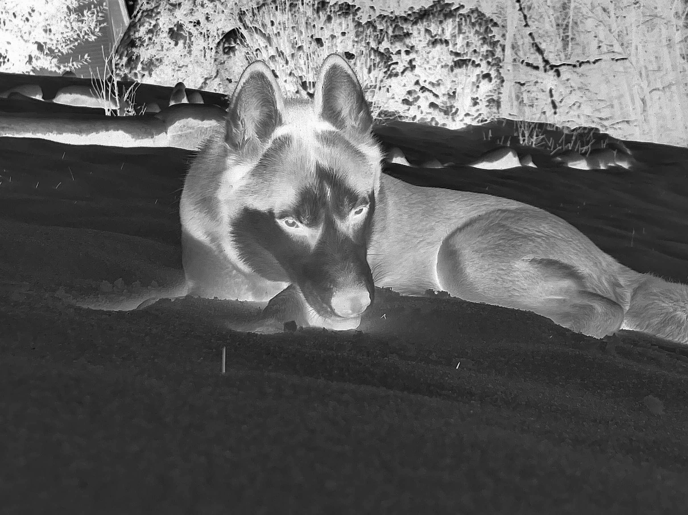
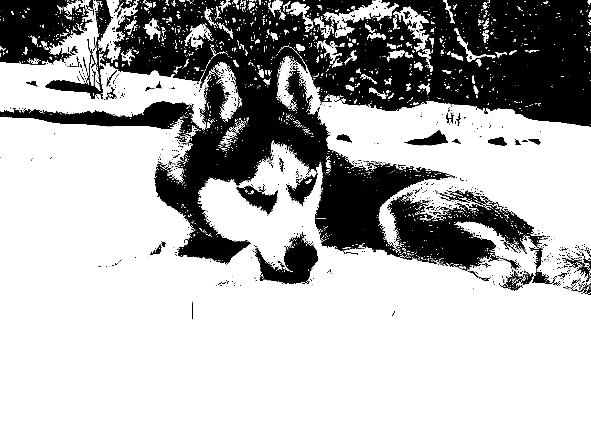

# Homework 6

## Unmodified script

The unmodified script and it's output is given below:

### Script

```c
/**********************************************************************************
 * imageproc.c
 * Usage: imageproc in_file_name out_file_name width height
 **********************************************************************************/

#include <stdio.h>
#include <stdlib.h>

int main(int argc, char *argv[])
{
	FILE *in, *out;
	int j, k, width, height;
	int **image_in, **image_out;

	if (argc < 5)
	{
		printf("ERROR: Insufficient parameters!\n");
		return 1;
	}

	width = atoi(argv[3]);
	height = atoi(argv[4]);

	image_in = (int **)calloc(height, sizeof(int *));
	if (!image_in)
	{
		printf("Error: Can't allocate memory!\n");
		return 1;
	}

	image_out = (int **)calloc(height, sizeof(int *));
	if (!image_out)
	{
		printf("Error: Can't allocate memory!\n");
		return 1;
	}

	for (j = 0; j < height; j++)
	{
		image_in[j] = (int *)calloc(width, sizeof(int));
		if (!image_in[j])
		{
			printf("Error: Can't allocate memory!\n");
			return 1;
		}

		image_out[j] = (int *)calloc(width, sizeof(int));
		if (!image_out[j])
		{
			printf("Error: Can't allocate memory!\n");
			return 1;
		}
	}

	if (!(in = fopen(argv[1], "rb")))
	{
		printf("ERROR: Can't open in_file!\n");
		return 1;
	}

	if (!(out = fopen(argv[2], "wb")))
	{
		printf("ERROR: Can't open out_file!\n");
		return 1;
	}

	for (j = 0; j < height; j++)
	{
		for (k = 0; k < width; k++)
		{
			if ((image_in[j][k] = getc(in)) == EOF)
			{
				printf("ERROR: Can't read from in_file!\n");
				return 1;
			}
		}
	}

	if (fclose(in) == EOF)
	{
		printf("ERROR: Can't close in_file!\n");
		return 1;
	}

	/********************************************************************/
	/* Image Processing begins                                          */
	/********************************************************************/

	for (j = 0; j < height; j++)
	{
		for (k = 0; k < width; k++)
		{
			image_out[j][k] = 255 - image_in[j][k];
		}
	}

	/********************************************************************/
	/* Image Processing ends                                            */
	/********************************************************************/

	/* save image_out into out_file in RAW format */
	for (j = 0; j < height; j++)
	{
		for (k = 0; k < width; k++)
		{
			if (putc(image_out[j][k], out) == EOF)
			{
				printf("ERROR: Can't write to out_file!\n");
				return 1;
			}
		}
	}

	if (fclose(out) == EOF)
	{
		printf("ERROR: Can't close out_file!\n");
		return 1;
	}

	for (j = 0; j < height; j++)
	{
		free(image_in[j]);
		free(image_out[j]);
	}
	free(image_in);
	free(image_out);

	return 0;
}
```

(Note: I did modify it to use fopen because I was having issues with fopen_s)

### Output

#### Original Image


#### Output Image



## Modified script

The script is "modified" to use OpenCV to read and modify the image. The script is given below:

### Script

```c
#include <iostream>
#include <string>
#include <opencv2/opencv.hpp>

using namespace cv;
using namespace std;

int main(int argc, char** argv)
{
    if (argc < 3)
    {
        cout << "Usage: imageprocessing input_file output_file" << endl;
        return -1;
    }

    // Read input image using OpenCV
    Mat input_image = imread(argv[1], IMREAD_GRAYSCALE);
    if (input_image.empty())
    {
        cout << "Error: Can't read input image!" << endl;
        return -1;
    }

    // Apply thresholding operator using OpenCV
    Mat output_image;
    threshold(input_image, output_image, 128, 255, THRESH_BINARY);

    // Display output image in a window using OpenCV
    namedWindow("Output Image", WINDOW_NORMAL);
    imshow("Output Image", output_image);
    waitKey(0);

    // Write output image to file using OpenCV
    imwrite(argv[2], output_image);

    return 0;
}
```

The instructions weren't really clear on what "image processing operator" to use, so I just used the thresholding operator.
As you can see, I apply the thresholding operator to the image. This essentially sets all pixels above 128 to 255 and all pixels below 128 to 0.

### Output

#### Original Image


#### Output Image



## 6.2 - Histogram Equalization

This section will use the histogram equalization operator to modify the image.

### Script

```c
#include <iostream>
#include <string>
#include <opencv2/opencv.hpp>

using namespace cv;
using namespace std;

int main(int argc, char **argv)
{
    if (argc < 3)
    {
        cout << "Usage: imageprocessing input_file output_file" << endl;
        return -1;
    }

    // Read input image using OpenCV
    Mat input_image = imread(argv[1], IMREAD_GRAYSCALE);
    if (input_image.empty())
    {
        cout << "Error: Can't read input image!" << endl;
        return -1;
    }

    // // Apply thresholding operator using OpenCV
    // Mat output_image;
    // threshold(input_image, output_image, 128, 255, THRESH_BINARY);

    // Perform histogram equalization using OpenCV
    Mat output_image;
    equalizeHist(input_image, output_image);

    // Display output image in a window using OpenCV
    namedWindow("Output Image", WINDOW_NORMAL);
    imshow("Output Image", output_image);
    waitKey(0);

    // Write output image to file using OpenCV
    imwrite(argv[2], output_image);

    return 0;
}
```

As you can see the `threshold` function is commented out and the `equalizeHist` function is used instead.

This will increase the contrast and brightness of the image by transforming the image's intensity values to a more uniform distribution.

### Output

#### Original Image


#### Output Image


Note: The color of the image is different because the image is converted to grayscale with the `IMREAD_GRAYSCALE` flag (so I didn't have to apply the operator on each channel).

## 6.3 - 3x3 mask

For this part I will apply the following 3x3 mask to the image

$$
\begin{bmatrix}
-1 & -1 & -1 \\
-1 & 9 & -1 \\
-1 & -1 & -1
\end{bmatrix}
$$

### Script

```c
#include <iostream>
#include <string>
#include <opencv2/opencv.hpp>

using namespace cv;
using namespace std;

int main(int argc, char **argv)
{
    if (argc < 3)
    {
        cout << "Usage: imageprocessing input_file output_file" << endl;
        return -1;
    }

    // Read input image using OpenCV
    Mat input_image = imread(argv[1], IMREAD_GRAYSCALE);
    if (input_image.empty())
    {
        cout << "Error: Can't read input image!" << endl;
        return -1;
    }

    // // Apply thresholding operator using OpenCV
    // Mat output_image;
    // threshold(input_image, output_image, 128, 255, THRESH_BINARY);

    // // Perform histogram equalization using OpenCV
    // Mat output_image;
    // equalizeHist(input_image, output_image);

    // Define 3x3 mask
    Mat kernel = (Mat_<float>(3, 3) << -1, -1, -1, -1, 9, -1, -1, -1, -1);

    // Apply mask to input image using OpenCV
    Mat output_image;
    filter2D(input_image, output_image, -1, kernel);

    // Display output image in a window using OpenCV
    namedWindow("Output Image", WINDOW_NORMAL);
    imshow("Output Image", output_image);
    waitKey(0);

    // Write output image to file using OpenCV
    imwrite(argv[2], output_image);

    return 0;
}
```

The script uses the `filter2D` function to apply the mask to the image from the matrix defined in the script.

Essentially, it sums the product of the mask and the image's pixels and sets the output pixel to that value.

Our partically mask will enhance the edges of the image, sharpening the image because the center pixel is 9 times the value of the surrounding pixels.

### Output

#### Original Image


#### Output Image


