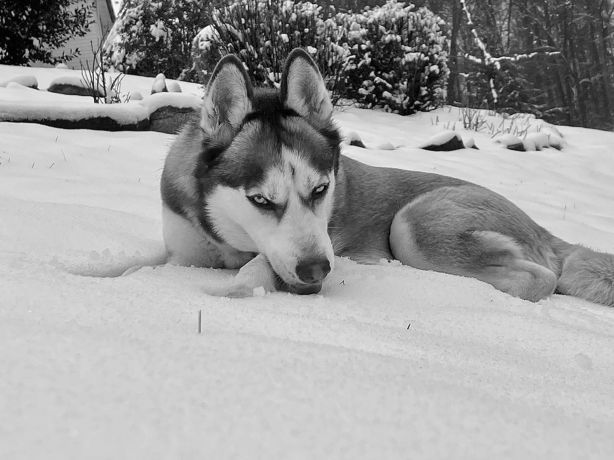
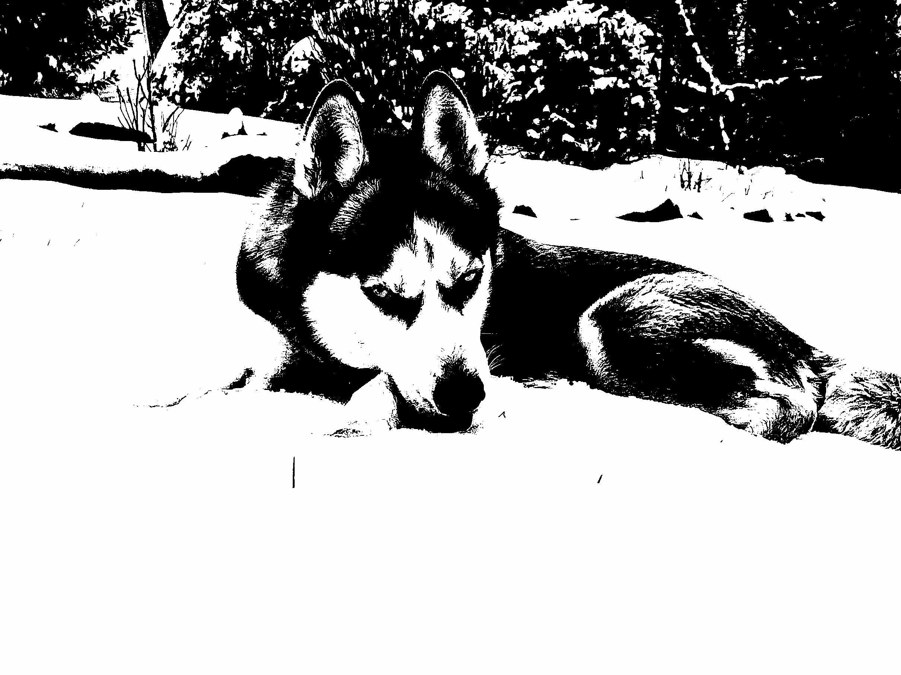

# Image Threshold Calculator

## Code

The following code was inserted under the image processing section of **imageprocessing.cpp**:

```c++
/********************************************************************/
/* Image Processing begins                                          */
/********************************************************************/

int foreground_sum = 0;
int foreground_count = 0;
int background_sum = 0;
int background_count = 0;
int threshold = 128;
int new_threshold;
int epsilon = 1;

while (1)
{
    // Reset the foreground and background variables
    foreground_sum = 0;
    foreground_count = 0;
    background_sum = 0;
    background_count = 0;

    // Compute the mean gray values of the foreground and background classes
    for (j = 0; j < height; j++)
    {
    	for (k = 0; k < width; k++)
    	{
    		if (image_in[j][k] > threshold)
    		{
    			foreground_sum += image_in[j][k];
    			foreground_count++;
    		}
    		else
    		{
    			background_sum += image_in[j][k];
    			background_count++;
    		}
    	}
    }

    // Compute a new threshold value
    foreground_sum /= foreground_count;
    background_sum /= background_count;
    new_threshold = (foreground_sum + background_sum) / 2;

    // Check if the difference between the old and new threshold values is less than epsilon
    if (abs(new_threshold - threshold) < epsilon)
    {
    	break;
    }

    threshold = new_threshold;
}

// Threshold the image based on the final threshold value
for (j = 0; j < height; j++)
{
    for (k = 0; k < width; k++)
    {
    	if (image_in[j][k] > threshold)
    	{
    		image_out[j][k] = 255;
    	}
    	else
    	{
    		image_out[j][k] = 0;
    	}
    }
}

/********************************************************************/
/* Image Processing ends                                            */
/********************************************************************/
```

In essence, I assign an arbitrary threshold value of 128 to start with. I then compute the mean gray values of the foreground and background classes. I then compute a new threshold value by averaging the foreground and background mean gray values. I then check if the difference between the old and new threshold values is less than epsilon. If it is, I break out of the loop. If not, I set the old threshold value to the new threshold value and repeat the process. Finally, I threshold the image based on the final threshold value.

## Results

### Original Image



### Thresholded Image


